# geostats-datasets

> 2D and 3D datasets for geostatistics in mining and oil & gas: three classic public sets and thirteen synthetic
> case studies, each built around the situations real projects throw at you.

<table>
<tr><td width="45%"><a href="mining/2d/walker-lake">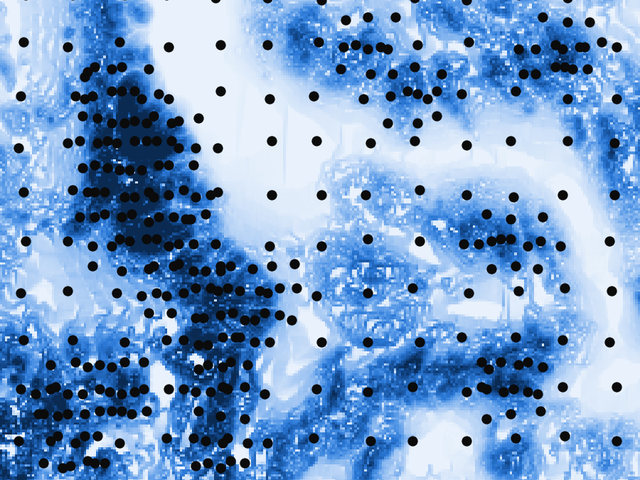</a></td><td width="55%" valign="middle">MINING · 2D · CLASSIC<h3><a href="mining/2d/walker-lake">Walker Lake</a></h3>470 clustered samples and the 78 000-node exhaustive truth.  declustering · variography · kriging checked against the truth</td></tr>
<tr><td width="55%" valign="middle">MINING · 2D · CLASSIC<h3><a href="mining/2d/jura">Jura</a></h3>Seven metals in topsoil, rock and land-use covariates, 100 validation points.  cokriging · categorical covariates · validation</td><td width="45%"><a href="mining/2d/jura">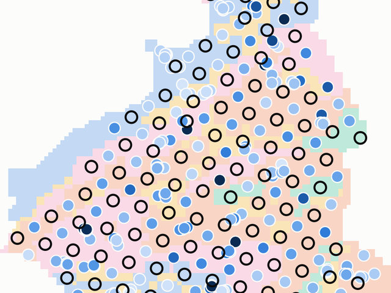</a></td></tr>
<tr><td width="45%"><a href="mining/2d/coal-seam-thickness">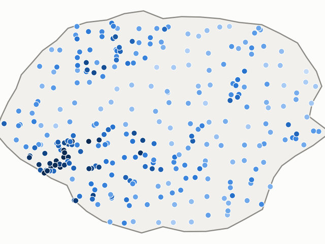</a></td><td width="55%" valign="middle">MINING · 2D · SYNTHETIC<h3><a href="mining/2d/coal-seam-thickness">Coal seam thickness</a></h3>295 boreholes, with infill drilled where the seam is thick.  preferential sampling · declustering · anisotropy · trend</td></tr>
<tr><td width="55%" valign="middle">MINING · 2D · SYNTHETIC<h3><a href="mining/2d/soil-geochemistry-survey">Soil geochemistry survey</a></h3>1 227 line samples, detection limits and exhaustive covariates.  censored data · external drift · lognormal variables</td><td width="45%"><a href="mining/2d/soil-geochemistry-survey">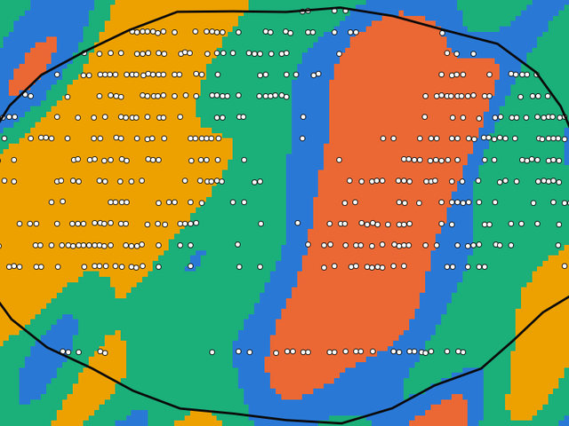</a></td></tr>
<tr><td width="45%"><a href="mining/3d/porphyry-geometallurgy">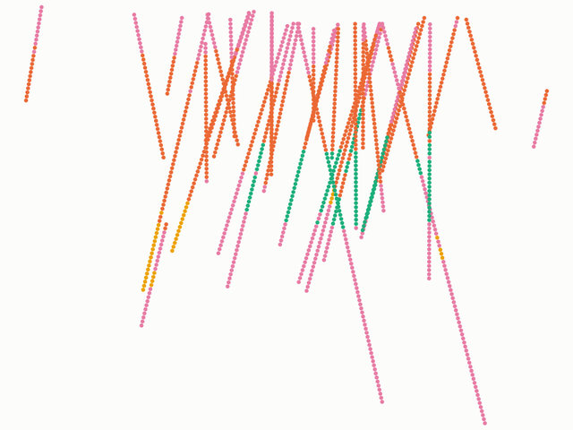</a></td><td width="55%" valign="middle">MINING · 3D · CLASSIC<h3><a href="mining/3d/porphyry-geometallurgy">Porphyry geometallurgy</a></h3>Mineralogy, grindability and recovery in three porphyry deposits.  geometallurgy · multivariate · block model</td></tr>
<tr><td width="55%" valign="middle">MINING · 3D · SYNTHETIC<h3><a href="mining/3d/stacked-sulphide-lenses">Stacked sulphide lenses</a></h3>Three dipping polymetallic lenses cut by 289 holes.  multivariate · density · domains · solids</td><td width="45%"><a href="mining/3d/stacked-sulphide-lenses">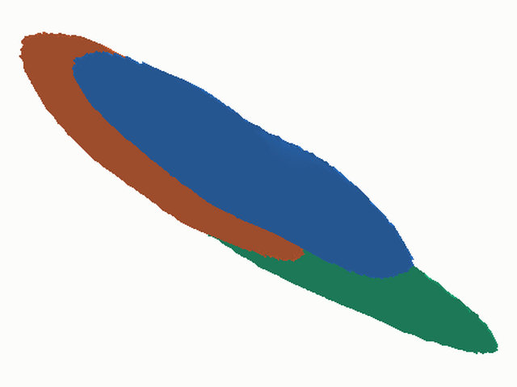</a></td></tr>
<tr><td width="45%"><a href="mining/3d/iron-formation-plateau">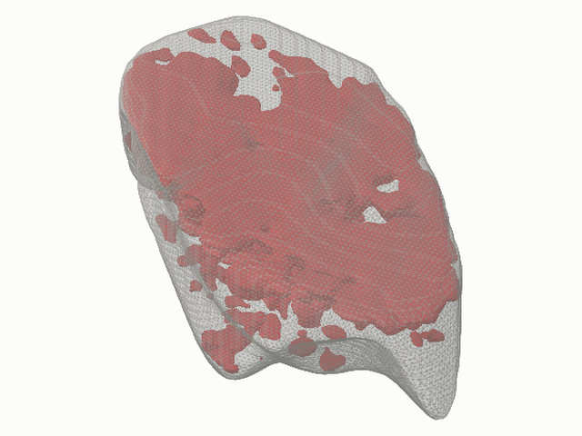</a></td><td width="55%" valign="middle">MINING · 3D · SYNTHETIC<h3><a href="mining/3d/iron-formation-plateau">Iron formation plateau</a></h3>Exploration holes and blastholes over the same deposit.  change of support · heterotopic cokriging · closure · block model</td></tr>
<tr><td width="55%" valign="middle">MINING · 3D · SYNTHETIC<h3><a href="mining/3d/vein-gold-grade-control">Vein gold grade control</a></h3>Four steep veins, 118 drill holes and 2 492 channels.  extreme skewness · top-cut · indicators · thin domains</td><td width="45%"><a href="mining/3d/vein-gold-grade-control">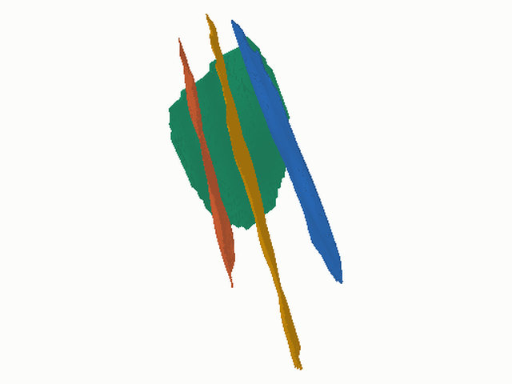</a></td></tr>
<tr><td width="45%"><a href="mining/3d/phosphate-weathering-profile">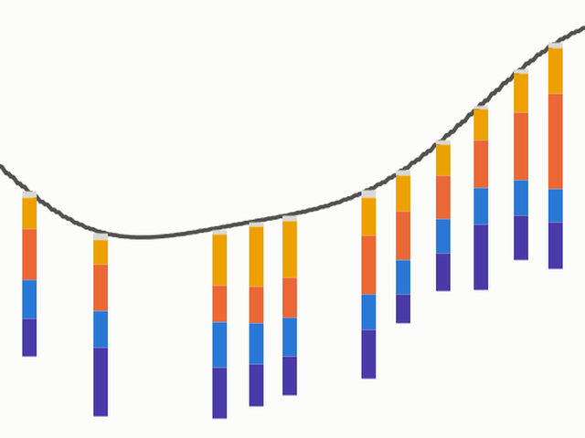</a></td><td width="55%" valign="middle">MINING · 3D · SYNTHETIC<h3><a href="mining/3d/phosphate-weathering-profile">Phosphate weathering profile</a></h3>Weathering horizons under rolling topography.  horizons · correlated oxides · trends</td></tr>
<tr><td width="55%" valign="middle">MINING · 3D · SYNTHETIC<h3><a href="mining/3d/nickel-laterite-profile">Nickel laterite profile</a></h3>448 vertical holes on a 50 m mesh with 25 m infill.  vertical trends · irregular contacts · two meshes</td><td width="45%"><a href="mining/3d/nickel-laterite-profile">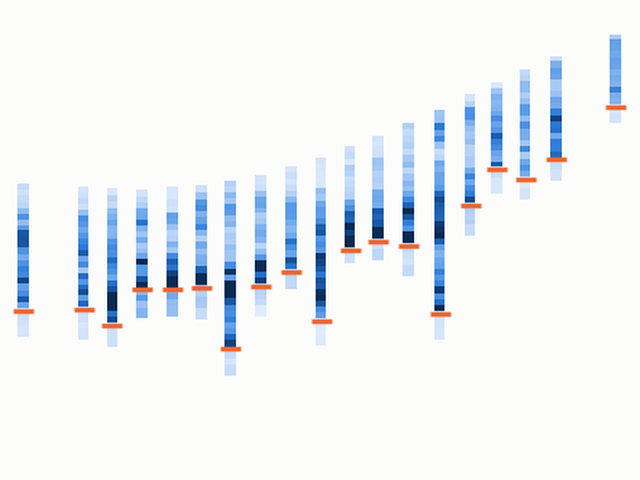</a></td></tr>
<tr><td width="45%"><a href="mining/3d/tailings-reprocessing">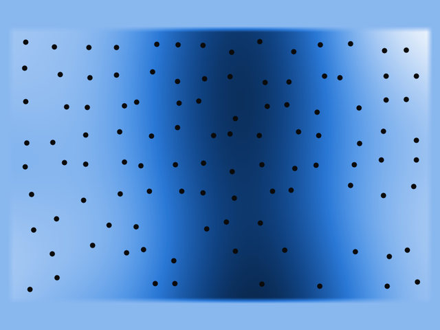</a></td><td width="55%" valign="middle">MINING · 3D · SYNTHETIC<h3><a href="mining/3d/tailings-reprocessing">Tailings reprocessing</a></h3>Beach-to-pond layering in a tailings storage facility.  censored data · facies trend · surfaces</td></tr>
<tr><td width="55%" valign="middle">OIL-GAS · 2D · SYNTHETIC<h3><a href="oil-gas/2d/seismic-guided-porosity">Seismic-guided porosity</a></h3>55 wells and an exhaustive seismic grid.  collocated cokriging · depth conversion · clustered wells</td><td width="45%"><a href="oil-gas/2d/seismic-guided-porosity">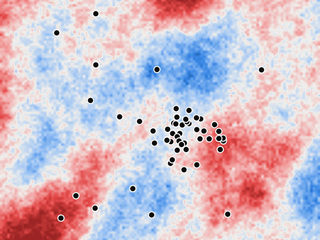</a></td></tr>
<tr><td width="45%"><a href="oil-gas/3d/deviated-well-logs">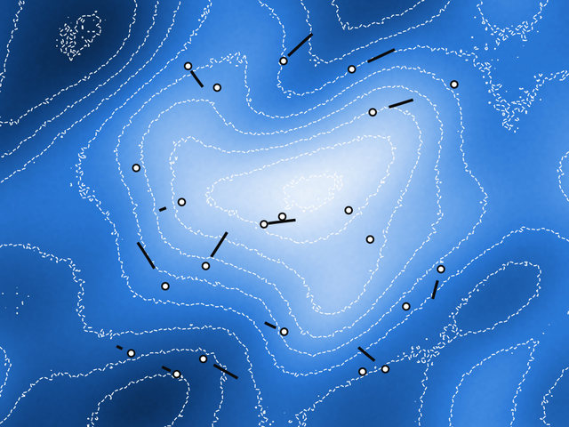</a></td><td width="55%" valign="middle">OIL-GAS · 3D · SYNTHETIC<h3><a href="oil-gas/3d/deviated-well-logs">Deviated well logs</a></h3>22 deviated wells with logs, tops and a seismic horizon.  petrophysics · external drift · heterotopic logs</td></tr>
<tr><td width="55%" valign="middle">OIL-GAS · 3D · SYNTHETIC<h3><a href="oil-gas/3d/facies-between-horizons">Facies between horizons</a></h3>30 wells with 0.2 m facies between three horizons.  plurigaussian · proportion trends · stratigraphic grids</td><td width="45%"><a href="oil-gas/3d/facies-between-horizons">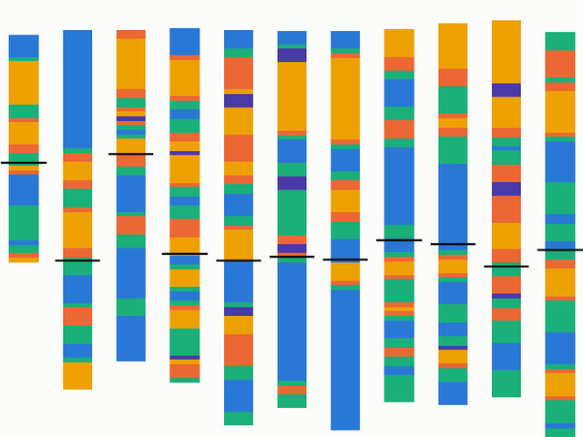</a></td></tr>
<tr><td width="45%"><a href="oil-gas/3d/fluvial-channel-reservoir">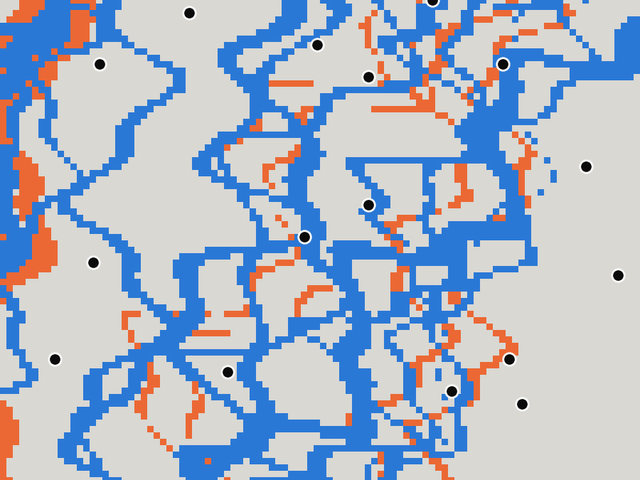</a></td><td width="55%" valign="middle">OIL-GAS · 3D · SYNTHETIC<h3><a href="oil-gas/3d/fluvial-channel-reservoir">Fluvial channel reservoir</a></h3>Exhaustive channel, levee and splay grid with 18 wells.  training image · MPS · poro-perm · seismic secondary</td></tr>
<tr><td width="55%" valign="middle">OIL-GAS · 3D · SYNTHETIC<h3><a href="oil-gas/3d/pore-scale-grain-image">Pore-scale grain image</a></h3>An 80³ binary grain and pore voxel image.  indicator variograms · Boolean model · truncated Gaussian</td><td width="45%"><a href="oil-gas/3d/pore-scale-grain-image">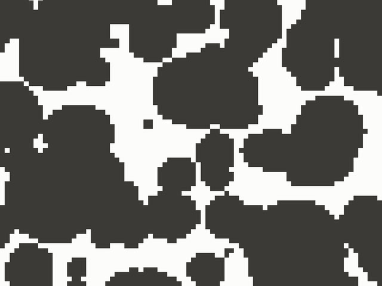</a></td></tr>
</table>

Each folder has its own README with the files, every column with units and ranges, and suggested exercises.

## Conventions

- CSV with a header row; an empty cell means not measured.
- Local coordinates in metres; `Z` is elevation, positive up (negative below sea level in oil & gas).
- Units are in the column name: `_PCT` %, `_PPM`, `_PPB`, `_GPT` g/t, `_M` m, `_MS` ms; `DENSITY` in t/m³.
- Holes: `collars.csv`, `surveys.csv`, `assays.csv`, `lithology.csv` (or `horizons.csv`). `FROM`/`TO` are downhole depths; `DIP` is positive down (90 = vertical), `AZIMUTH` clockwise from +Y.
- Wells: `wells.csv` and `trajectories.csv` with `INCLINATION` (0 = vertical); `MD` is measured depth from `KB`.
- `<VAR>_BDL = 1` marks a result below the detection limit; the value column holds the limit.
- Solids are closed binary STL with outward normals, in the data coordinates.

## License

Synthetic datasets: [CC BY 4.0](LICENSE). Classic datasets keep their original terms and references (see their folders); `porphyry-geometallurgy` is CC BY-NC-SA 4.0.
