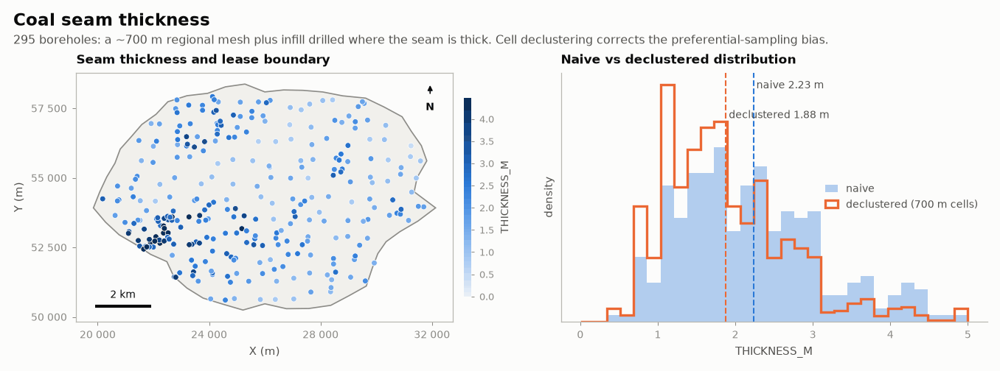

# Coal seam thickness

MINING · 2D · SYNTHETIC

295 boreholes, with infill drilled where the seam is thick. Synthetic dataset.

## About the data

295 boreholes in `boreholes.csv`: a ~700 m regional grid plus 150 infill holes drilled where the seam is thick (preferential sampling, so the naive mean is biased). `CATEGORY`: `MECHANIZED`, `SELECTIVE`, `UNECONOMIC`. `ASH_PCT` and `CV_MJKG` missing in ~15 % of holes. `grid.csv` is a 100 m grid with an `INSIDE` flag for the lease in `boundary.csv`.

## Suggested exercises

- Decluster thickness (cell, polygons) and compare with the naive mean.
- Model the anisotropy and the eastward thinning trend (universal kriging).
- Estimate `CATEGORY` probabilities by indicator kriging inside the lease.

Techniques: preferential sampling · declustering · anisotropy · trend.

## Files

| File | Rows | Size |
|---|---|---|
| [`boreholes.csv`](boreholes.csv) | 295 | 13 kB |
| [`boundary.csv`](boundary.csv) | 48 | 1 kB |
| [`grid.csv`](grid.csv) | 10 800 | 0.2 MB |

## Columns

### `boreholes.csv`

| Column | Unit | Range / values | Missing |
|---|---|---|---|
| `ID` |  | 1 – 295 |  |
| `X` | m | 20180 – 31703 |  |
| `Y` | m | 50607 – 57924 |  |
| `THICKNESS_M` | m | 0.49 – 5.37 |  |
| `ASH_PCT` | % | 4 – 24.9 | 16% |
| `CV_MJKG` | MJ/kg | 23.28 – 30.92 | 16% |
| `CATEGORY` |  | `MECHANIZED`, `SELECTIVE`, `UNECONOMIC` |  |

### `boundary.csv`

| Column | Unit | Range / values | Missing |
|---|---|---|---|
| `VERTEX` |  | 1 – 48 |  |
| `X` | m | 19848 – 32129 |  |
| `Y` | m | 50248 – 58374 |  |

### `grid.csv`

| Column | Unit | Range / values | Missing |
|---|---|---|---|
| `X` | m | 20050 – 31950 |  |
| `Y` | m | 50050 – 58950 |  |
| `INSIDE` | flag | `1`, `0` |  |

[← all datasets](../../../README.md)
