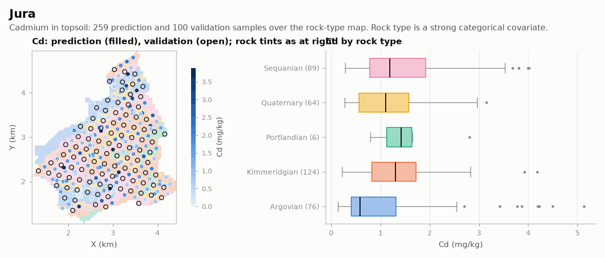

# Jura

MINING · 2D · CLASSIC

Seven metals in topsoil, rock and land-use covariates, 100 validation points. Classic public dataset, kept as published.

## About the data

`X, Y` in km. Metals in mg/kg. Use `validation.csv` only to check predictions.

- Goovaerts, P. (1997). *Geostatistics for Natural Resources Evaluation*. Oxford University Press.
- Atteia, O., Dubois, J.-P. & Webster, R. (1994). *Environmental Pollution* 86, 315–327. [doi](https://doi.org/10.1016/0269-7491(94)90172-4)
- Webster, R., Atteia, O. & Dubois, J.-P. (1994). *European Journal of Soil Science* 45, 205–218. [doi](https://doi.org/10.1111/j.1365-2389.1994.tb00502.x)

Taken from the R package [gstat](https://cran.r-project.org/package=gstat).

## Suggested exercises

- Cokrige Cd with Ni or Zn and compare errors on `validation.csv`.
- Use `Rock` as a stratification or external drift and measure the gain.
- Indicator kriging of Cd above a regulatory threshold.

Techniques: cokriging · categorical covariates · validation.

## Files

| File | Rows | Size |
|---|---|---|
| [`grid.csv`](grid.csv) | 5 957 | 0.2 MB |
| [`prediction.csv`](prediction.csv) | 259 | 18 kB |
| [`validation.csv`](validation.csv) | 100 | 7 kB |

## Columns

### `grid.csv`

| Column | Unit | Range / values | Missing |
|---|---|---|---|
| `X` | m | 0.3 – 5.1 |  |
| `Y` | m | 0.1 – 5.9 |  |
| `Landuse` |  | `Meadow`, `Pasture`, `Forest`, `Tillage` |  |
| `Rock` |  | `Kimmeridgian`, `Sequanian`, `Argovian`, `Quaternary`, `Portlandian` |  |

### `prediction.csv`

| Column | Unit | Range / values | Missing |
|---|---|---|---|
| `X` | m | 0.626 – 4.92 |  |
| `Y` | m | 0.58 – 5.69 |  |
| `Landuse` |  | `Meadow`, `Pasture`, `Forest`, `Tillage` |  |
| `Rock` |  | `Kimmeridgian`, `Sequanian`, `Quaternary`, `Argovian`, `Portlandian` |  |
| `Cd` |  | 0.135 – 5.129 |  |
| `Co` |  | 1.552 – 17.72 |  |
| `Cr` |  | 8.72 – 67.6 |  |
| `Cu` |  | 3.96 – 166.4 |  |
| `Ni` |  | 4.2 – 53.2 |  |
| `Pb` |  | 18.96 – 229.6 |  |
| `Zn` |  | 25.2 – 219.3 |  |

### `validation.csv`

| Column | Unit | Range / values | Missing |
|---|---|---|---|
| `X` | m | 0.491 – 4.745 |  |
| `Y` | m | 0.524 – 5.285 |  |
| `Landuse` |  | `Meadow`, `Pasture`, `Forest`, `Tillage` |  |
| `Rock` |  | `Kimmeridgian`, `Sequanian`, `Argovian`, `Quaternary`, `Portlandian` |  |
| `Cd` |  | 0.325 – 3.78 |  |
| `Co` |  | 1.652 – 20.6 |  |
| `Cr` |  | 3.32 – 70 |  |
| `Cu` |  | 3.552 – 154.6 |  |
| `Ni` |  | 1.98 – 43.68 |  |
| `Pb` |  | 18.68 – 300 |  |
| `Zn` |  | 25 – 259.8 |  |

[← all datasets](../../../README.md)
