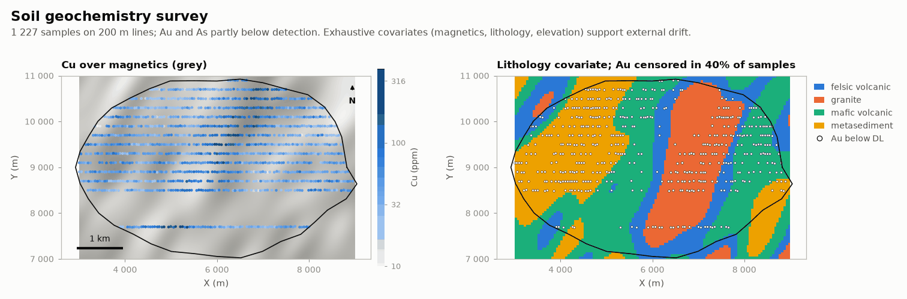

# Soil geochemistry survey

MINING · 2D · SYNTHETIC

1 227 line samples, detection limits and exhaustive covariates. Synthetic dataset.

## About the data

1 227 soil samples on 200 m lines, 50 m stations, some lines missing. `ZN_PPM` analysed in ~70 % of samples. Detection limits: `AU_PPB` < 2, `AS_PPM` < 5 (`AU_BDL`, `AS_BDL`). `covariates.csv`: 50 m grid with `ELEVATION_M`, `MAG_NT` and `LITHOLOGY`. The mineralised corridor follows the magnetic trend.

## Suggested exercises

- Handle censored Au and As (substitution, maximum likelihood, indicator).
- Krige Cu with external drift on `MAG_NT`, or stratify by `LITHOLOGY`.
- Collocated cokriging of Zn (heterotopic) with Cu.

Techniques: censored data · external drift · lognormal variables.

## Files

| File | Rows | Size |
|---|---|---|
| [`boundary.csv`](boundary.csv) | 36 | 1 kB |
| [`covariates.csv`](covariates.csv) | 9 600 | 0.4 MB |
| [`samples.csv`](samples.csv) | 1 227 | 50 kB |

## Columns

### `boundary.csv`

| Column | Unit | Range / values | Missing |
|---|---|---|---|
| `VERTEX` |  | 1 – 36 |  |
| `X` | m | 2922 – 9045 |  |
| `Y` | m | 7025 – 10925 |  |

### `covariates.csv`

| Column | Unit | Range / values | Missing |
|---|---|---|---|
| `X` | m | 3025 – 8975 |  |
| `Y` | m | 7025 – 10975 |  |
| `ELEVATION_M` | m | 269.5 – 553.8 |  |
| `MAG_NT` | nT | 51437 – 52465 |  |
| `LITHOLOGY` |  | `MAFIC_VOLCANIC`, `METASEDIMENT`, `GRANITE`, `FELSIC_VOLCANIC` |  |
| `INSIDE` | flag | `1`, `0` |  |

### `samples.csv`

| Column | Unit | Range / values | Missing |
|---|---|---|---|
| `ID` |  | 1 – 1227 |  |
| `X` | m | 3005 – 8952 |  |
| `Y` | m | 7691 – 10904 |  |
| `CU_PPM` | ppm | 10 – 281 |  |
| `ZN_PPM` | ppm | 16 – 345 | 29% |
| `AU_PPB` | ppb | 2 – 88.6 |  |
| `AS_PPM` | ppm | 5 – 121 |  |
| `AU_BDL` | flag | `0`, `1` |  |
| `AS_BDL` | flag | `0`, `1` |  |

[← all datasets](../../../README.md)
