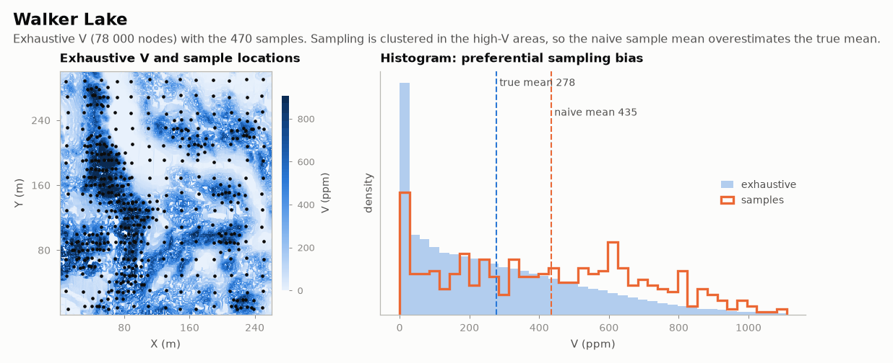

# Walker Lake

MINING · 2D · CLASSIC

470 clustered samples and the 78 000-node exhaustive truth. Classic public dataset, kept as published.

## About the data

1 m grid, 260 × 300. `V`, `U` in ppm; `T` type (1, 2). `U` missing in 195 samples.

Isaaks, E.H. & Srivastava, R.M. (1989). *An Introduction to Applied Geostatistics*. Oxford University Press.

Taken from the R package [gstat](https://cran.r-project.org/package=gstat).

## Suggested exercises

- Compare naive, cell- and polygon-declustered means with the exhaustive mean.
- Model the anisotropic variogram of `V` and krige; score the map against `exhaustive.csv`.
- Cokrige `U` (missing in 195 samples) with `V`.

Techniques: declustering · variography · kriging checked against the truth.

## Files

| File | Rows | Size |
|---|---|---|
| [`exhaustive.csv`](exhaustive.csv) | 78 000 | 2.0 MB |
| [`sample.csv`](sample.csv) | 470 | 13 kB |

## Columns

### `exhaustive.csv`

| Column | Unit | Range / values | Missing |
|---|---|---|---|
| `X` | m | 1 – 260 |  |
| `Y` | m | 1 – 300 |  |
| `U` |  | 0 – 9500 |  |
| `V` |  | 0 – 1631 |  |

### `sample.csv`

| Column | Unit | Range / values | Missing |
|---|---|---|---|
| `ID` |  | 1 – 470 |  |
| `X` | m | 8 – 251 |  |
| `Y` | m | 8 – 291 |  |
| `V` |  | 0 – 1528 |  |
| `U` |  | 0 – 5190 | 41% |
| `T` |  | `2`, `1` |  |

[← all datasets](../../../README.md)
