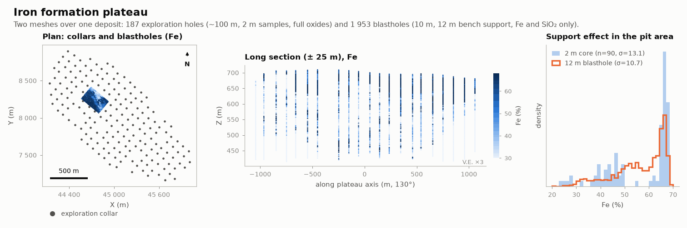

# Iron formation plateau

MINING · 3D · SYNTHETIC

Exploration holes and blastholes over the same deposit. Synthetic dataset.

## About the data

Two drilling meshes over the same deposit:

- **Exploration**: 187 holes on a ~100 m grid rotated 130° (`collars`, `surveys`, `assays`, `lithology`). 2 m samples in ore, 4 m in waste. `FE, SIO2, AL2O3, P, MN, LOI` (%); `DENSITY` in 30 % of samples.
- **Grade control**: `blastholes.csv`, 1 953 blastholes on a 10 m pattern in part of the pit, three 12 m benches. `FE_PCT` and `SIO2_PCT` only. Each value is the bench average (12 m support instead of 2 m) with a larger analytical error.

Use it for change of support, heterotopic multivariate estimation, and exploration vs grade-control reconciliation. Oxides close to ≤ 100 % (Fe as Fe₂O₃, P as P₂O₅, Mn as MnO). `LITH`: `CG` canga, `HF` friable hematite, `IF` friable itabirite, `HC` compact hematite, `IC` compact itabirite, `LAT` laterite, `MAF` mafic. `block_model.csv`: 25 × 25 × 12 m blocks below topography with `LITH` at the centroid. `iron_formation.stl` (envelope), `high_grade.stl` (HF + HC).

## Suggested exercises

- Compare the variance of 2 m core and 12 m blasthole Fe (change of support).
- Cokrige Fe with SiO₂ using both campaigns (heterotopic, different supports).
- Estimate the block model by `LITH` domain and reconcile against the blastholes.
- Check the oxide closure of estimated blocks.

Techniques: change of support · heterotopic cokriging · closure · block model.

## Files

| File | Rows | Size |
|---|---|---|
| [`assays.csv`](assays.csv) | 17 475 | 1.0 MB |
| [`blastholes.csv`](blastholes.csv) | 1 953 | 85 kB |
| [`block_model.csv`](block_model.csv) | 129 278 | 3.3 MB |
| [`collars.csv`](collars.csv) | 187 | 7 kB |
| [`high_grade.stl`](high_grade.stl) | | 3.1 MB |
| [`iron_formation.stl`](iron_formation.stl) | | 2.6 MB |
| [`lithology.csv`](lithology.csv) | 7 573 | 0.2 MB |
| [`surveys.csv`](surveys.csv) | 1 088 | 28 kB |
| [`topography.csv`](topography.csv) | 14 641 | 0.3 MB |

## Columns

### `assays.csv`

| Column | Unit | Range / values | Missing |
|---|---|---|---|
| `HOLE_ID` |  | `FD0001` … `FD0187` (187 unique) |  |
| `FROM` | m | 0 – 290 |  |
| `TO` | m | 0.25 – 294.1 |  |
| `FE_PCT` | % | 2.1 – 68.46 |  |
| `SIO2_PCT` | % | 0.52 – 95.93 |  |
| `AL2O3_PCT` | % | 0.07 – 43.11 |  |
| `P_PCT` | % | 0.003 – 0.638 |  |
| `MN_PCT` | % | 0.005 – 2.82 |  |
| `LOI_PCT` | % | 0.08 – 22.2 |  |
| `DENSITY` | t/m³ | 1.96 – 4.84 | 70% |

### `blastholes.csv`

| Column | Unit | Range / values | Missing |
|---|---|---|---|
| `ID` |  | 1 – 1953 |  |
| `X` | m | 44566 – 44923 |  |
| `Y` | m | 8067 – 8412 |  |
| `Z_TOP` | m | `696`, `684`, `672` |  |
| `Z_BOTTOM` | m | `684`, `672`, `660` |  |
| `FE_PCT` | % | 14.33 – 68.87 |  |
| `SIO2_PCT` | % | 0.1 – 76.43 |  |

### `block_model.csv`

| Column | Unit | Range / values | Missing |
|---|---|---|---|
| `X` | m | 43938 – 46138 |  |
| `Y` | m | 7062 – 9062 |  |
| `Z` | m | 306 – 690 |  |
| `LITH` |  | `MAF`, `IC`, `HF`, `HC`, `IF`, `LAT`, `CG` |  |

### `collars.csv`

| Column | Unit | Range / values | Missing |
|---|---|---|---|
| `HOLE_ID` |  | `FD0001` … `FD0187` (187 unique) |  |
| `X` | m | 44138 – 46009 |  |
| `Y` | m | 7165 – 8896 |  |
| `Z` | m | 655.2 – 715.6 |  |
| `LENGTH` | m | 60 – 294.1 |  |
| `TYPE` |  | `DD` |  |

### `lithology.csv`

| Column | Unit | Range / values | Missing |
|---|---|---|---|
| `HOLE_ID` |  | `FD0001` … `FD0187` (187 unique) |  |
| `FROM` | m | 0 – 289 |  |
| `TO` | m | 0.25 – 294.1 |  |
| `LITH` |  | `IC`, `HC`, `HF`, `IF`, `CG`, `MAF`, `LAT` |  |

### `surveys.csv`

| Column | Unit | Range / values | Missing |
|---|---|---|---|
| `HOLE_ID` |  | `FD0001` … `FD0187` (187 unique) |  |
| `DEPTH` | m | 0 – 294.1 |  |
| `DIP` | ° | 59.45 – 90 |  |
| `AZIMUTH` | ° | 38.21 – 221.9 |  |

### `topography.csv`

| Column | Unit | Range / values | Missing |
|---|---|---|---|
| `X` | m | 43500 – 46500 |  |
| `Y` | m | 6500 – 9500 |  |
| `Z` | m | 506.7 – 715.7 |  |

[← all datasets](../../../README.md)
