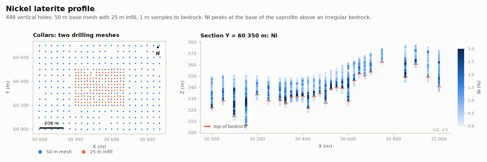

# Nickel laterite profile

MINING · 3D · SYNTHETIC

448 vertical holes on a 50 m mesh with 25 m infill. Synthetic dataset.

## About the data

448 vertical holes, 50 m grid with a 25 m infill in the centre, 1 m samples to 2–5 m into bedrock. Horizons: `FERR` ferricrete, `LIM` limonite, `SAP` saprolite, `BRK` bedrock. The bedrock contact is irregular (short range). Ni is richer toward the saprolite base; Co is concentrated in the limonite.

## Suggested exercises

- Estimate the bedrock surface with the 50 m mesh, then check against the 25 m infill.
- Model Ni with a depth-relative coordinate inside the saprolite.
- Compare variograms from the two meshes at short lags.

Techniques: vertical trends · irregular contacts · two meshes.

## Files

| File | Rows | Size |
|---|---|---|
| [`assays.csv`](assays.csv) | 10 810 | 0.6 MB |
| [`collars.csv`](collars.csv) | 448 | 17 kB |
| [`horizons.csv`](horizons.csv) | 1 773 | 38 kB |
| [`surveys.csv`](surveys.csv) | 896 | 19 kB |

## Columns

### `assays.csv`

| Column | Unit | Range / values | Missing |
|---|---|---|---|
| `HOLE_ID` |  | `NL0001` … `NL0448` (448 unique) |  |
| `FROM` | m | 0 – 62.9 |  |
| `TO` | m | 0.1 – 64 |  |
| `NI_PCT` | % | 0.043 – 8.611 |  |
| `CO_PCT` | % | 0.001 – 1.422 |  |
| `FE_PCT` | % | 1.91 – 57.89 |  |
| `MGO_PCT` | % | 0.1 – 66.05 |  |
| `SIO2_PCT` | % | 1.93 – 63.4 |  |
| `AL2O3_PCT` | % | 0.12 – 40.9 |  |

### `collars.csv`

| Column | Unit | Range / values | Missing |
|---|---|---|---|
| `HOLE_ID` |  | `NL0001` … `NL0448` (448 unique) |  |
| `X` | m | 29997 – 31003 |  |
| `Y` | m | 59997 – 60703 |  |
| `Z` | m | 335 – 383.6 |  |
| `LENGTH` | m | 12 – 64 |  |
| `TYPE` |  | `RC` |  |

### `horizons.csv`

| Column | Unit | Range / values | Missing |
|---|---|---|---|
| `HOLE_ID` |  | `NL0001` … `NL0448` (448 unique) |  |
| `FROM` | m | 0 – 59.6 |  |
| `TO` | m | 0.1 – 64 |  |
| `HORIZON` |  | `LIM`, `SAP`, `BRK`, `FERR` |  |

### `surveys.csv`

| Column | Unit | Range / values | Missing |
|---|---|---|---|
| `HOLE_ID` |  | `NL0001` … `NL0448` (448 unique) |  |
| `DEPTH` | m | 0 – 64 |  |
| `DIP` | ° | `90` |  |
| `AZIMUTH` | ° | `0` |  |

[← all datasets](../../../README.md)
