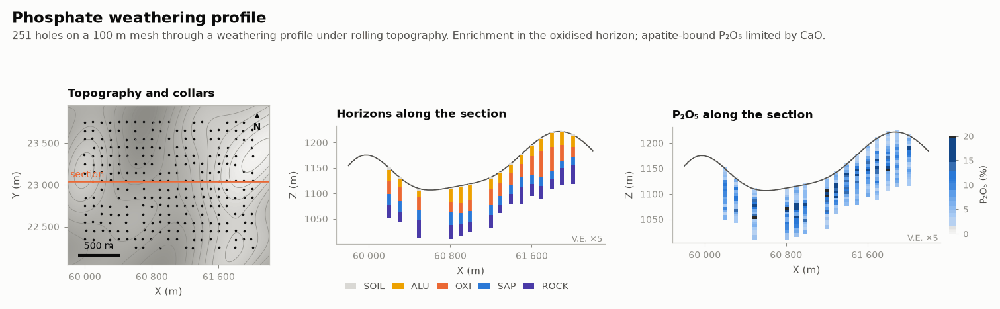

# Phosphate weathering profile

MINING · 3D · SYNTHETIC

Weathering horizons under rolling topography. Synthetic dataset.

## About the data

251 holes on a 100 m grid, mostly vertical (`RC`), some inclined (`DD`); 5 m samples. `horizons.csv`: `SOIL`, `ALU` (aluminous), `OXI` (oxidised ore), `SAP` (saprolite), `ROCK`. Weathering is thicker under hills. `P2O5_AP_PCT` is apatite-bound P₂O₅, limited by CaO/1.318. Oxides sum ≤ 95 %. `topography.csv` on a 10 m grid.

## Suggested exercises

- Model the horizon surfaces from the logged contacts and the topography.
- Estimate P₂O₅ by horizon; compare with a single global domain.
- Map the CaO/P₂O₅ ratio (apatite vs aluminous phosphate).

Techniques: horizons · correlated oxides · trends.

## Files

| File | Rows | Size |
|---|---|---|
| [`assays.csv`](assays.csv) | 5 039 | 0.3 MB |
| [`collars.csv`](collars.csv) | 251 | 10 kB |
| [`horizons.csv`](horizons.csv) | 1 255 | 29 kB |
| [`surveys.csv`](surveys.csv) | 858 | 22 kB |
| [`topography.csv`](topography.csv) | 46 031 | 1.1 MB |

## Columns

### `assays.csv`

| Column | Unit | Range / values | Missing |
|---|---|---|---|
| `HOLE_ID` |  | `PF0001` … `PF0251` (251 unique) |  |
| `FROM` | m | 0 – 134.9 |  |
| `TO` | m | 0.5 – 139.8 |  |
| `P2O5_PCT` | % | 0.5 – 36.58 |  |
| `P2O5_AP_PCT` | % | 0.05 – 23.89 |  |
| `CAO_PCT` | % | 0.07 – 36.16 |  |
| `SIO2_PCT` | % | 4.26 – 54.8 |  |
| `FE2O3_PCT` | % | 5.88 – 66.13 |  |
| `AL2O3_PCT` | % | 0.31 – 61.04 |  |
| `MGO_PCT` | % | 0.09 – 45.91 | 20% |

### `collars.csv`

| Column | Unit | Range / values | Missing |
|---|---|---|---|
| `HOLE_ID` |  | `PF0001` … `PF0251` (251 unique) |  |
| `X` | m | 59990 – 62009 |  |
| `Y` | m | 22246 – 23756 |  |
| `Z` | m | 1073 – 1235 |  |
| `LENGTH` | m | 63.38 – 139.8 |  |
| `TYPE` |  | `RC`, `DD` |  |

### `horizons.csv`

| Column | Unit | Range / values | Missing |
|---|---|---|---|
| `HOLE_ID` |  | `PF0001` … `PF0251` (251 unique) |  |
| `FROM` | m | 0 – 118.8 |  |
| `TO` | m | 0.5 – 139.8 |  |
| `HORIZON` |  | `SOIL`, `ALU`, `OXI`, `SAP`, `ROCK` |  |

### `surveys.csv`

| Column | Unit | Range / values | Missing |
|---|---|---|---|
| `HOLE_ID` |  | `PF0001` … `PF0251` (251 unique) |  |
| `DEPTH` | m | 0 – 139.8 |  |
| `DIP` | ° | 59.69 – 90 |  |
| `AZIMUTH` | ° | 178.9 – 181.3 |  |

### `topography.csv`

| Column | Unit | Range / values | Missing |
|---|---|---|---|
| `X` | m | 59800 – 62200 |  |
| `Y` | m | 22050 – 23950 |  |
| `Z` | m | 1072 – 1236 |  |

[← all datasets](../../../README.md)
