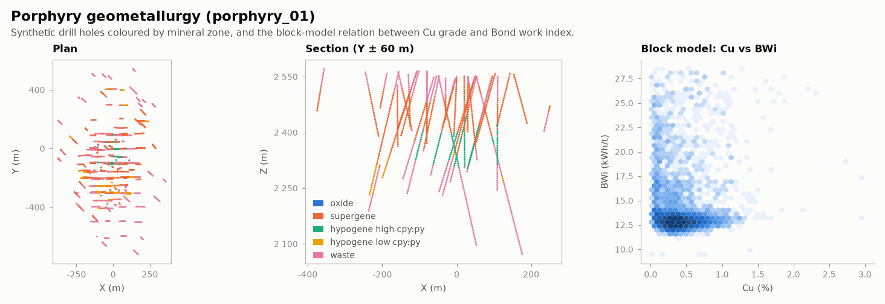

# Porphyry geometallurgy

MINING · 3D · CLASSIC

Mineralogy, grindability and recovery in three porphyry deposits. Classic public dataset, kept as published.

## About the data

Three porphyry Cu datasets, GSLIB converted to CSV. `minz`: 1 oxide, 2 supergene, 3 hypogene high cpy:py, 4 hypogene low cpy:py, 5 waste. Minerals in %, `bwi` in kWh/t.

Garrido, M., Sepúlveda, E., Ortiz, J. & Townley, B. (2020). *Natural Resources Research* 29, 3527–3545. [doi](https://doi.org/10.1007/s11053-020-09692-6). From [exepulveda/geomet_datasets](https://github.com/exepulveda/geomet_datasets). License: [CC BY-NC-SA 4.0](https://creativecommons.org/licenses/by-nc-sa/4.0/) (`LICENSE` in the folder).

## Suggested exercises

- Multivariate simulation of the mineralogy honouring `correlations.csv`.
- Model BWi and recovery as non-additive variables on the block model.
- Domain the deposit by `minz` and compare domained vs global estimates.

Techniques: geometallurgy · multivariate · block model.

## Files

| File | Rows | Size |
|---|---|---|
| [`LICENSE`](LICENSE) | | 0 kB |
| [`porphyry_01/block_model.csv`](porphyry_01/block_model.csv) | 153 076 | 24.0 MB |
| [`porphyry_01/correlations.csv`](porphyry_01/correlations.csv) | 7 | 1 kB |
| [`porphyry_01/grindability_distribution.csv`](porphyry_01/grindability_distribution.csv) | 1 366 | 9 kB |
| [`porphyry_01/mineralogical_distributions.csv`](porphyry_01/mineralogical_distributions.csv) | 741 | 22 kB |
| [`porphyry_01/pseudo_drillholes.csv`](porphyry_01/pseudo_drillholes.csv) | 3 101 | 76 kB |
| [`porphyry_01/synthetic_drillholes.csv`](porphyry_01/synthetic_drillholes.csv) | 6 817 | 1.5 MB |
| [`porphyry_02/drillholes.csv`](porphyry_02/drillholes.csv) | 4 597 | 1.1 MB |
| [`porphyry_02/topography.csv`](porphyry_02/topography.csv) | 13 774 | 0.3 MB |
| [`porphyry_03/drillholes.csv`](porphyry_03/drillholes.csv) | 3 467 | 0.8 MB |
| [`porphyry_03/topography.csv`](porphyry_03/topography.csv) | 13 774 | 0.3 MB |

## Columns

### `porphyry_01/block_model.csv`

| Column | Unit | Range / values | Missing |
|---|---|---|---|
| `x` |  | -510 – 450 |  |
| `y` |  | -860 – 540 |  |
| `z` |  | 1740 – 2600 |  |
| `ton` |  | `1000`, `0` |  |
| `clays` |  | 0 – 40.67 |  |
| `chalcocite` |  | 0 – 2.414 |  |
| `bornite` |  | 0 – 3.445 |  |
| `chalcopyrite` |  | 0 – 7.583 |  |
| `tennantite` |  | 0 – 0.545 |  |
| `molibdenite` |  | 0 – 0.476 |  |
| `pyrite` |  | 0 – 24.42 |  |
| `cu` |  | 0 – 4.06 |  |
| `mo` |  | 0 – 0.285 |  |
| `as` |  | 0 – 0.111 |  |
| `rec` |  | 0 – 94.86 |  |
| `bwi` |  | 0 – 28.57 |  |

### `porphyry_01/correlations.csv`

| Column | Unit | Range / values | Missing |
|---|---|---|---|
| `Nscore:data` |  | `clays`, `chalcocite`, `bornite`, `chalcopyrite`, `tennantite`, `molibdenite`, `pyrite` |  |
| `clays` |  | `1`, `-0.49`, `0.077`, `0.00787`, `-0.0754`, `-0.00649`, `-0.303` |  |
| `chalcocite` |  | `-0.49`, `1`, `0.0831`, `-0.5`, `0.0956`, `-0.0916`, `0.226` |  |
| `bornite` |  | `0.077`, `0.0831`, `1`, `0.18`, `0.352`, `0.639`, `-0.764` |  |
| `chalcopyrite` |  | `0.00787`, `-0.5`, `0.18`, `1`, `0.251`, `0.528`, `-0.26` |  |
| `tennantite` |  | `-0.0754`, `0.0956`, `0.352`, `0.251`, `1`, `0.426`, `-0.161` |  |
| `molibdenite` |  | `-0.00649`, `-0.0916`, `0.639`, `0.528`, `0.426`, `1`, `-0.55` |  |
| `pyrite` |  | `-0.303`, `0.226`, `-0.764`, `-0.26`, `-0.161`, `-0.55`, `1` |  |

### `porphyry_01/grindability_distribution.csv`

| Column | Unit | Range / values | Missing |
|---|---|---|---|
| `bwi` |  | -9 – 28.07 |  |

### `porphyry_01/mineralogical_distributions.csv`

| Column | Unit | Range / values | Missing |
|---|---|---|---|
| `clays` |  | 0 – 29.79 |  |
| `chalcocite` |  | 0 – 2.71 |  |
| `bornite` |  | 0 – 4.56 |  |
| `chalcopyrite` |  | 0.02 – 7.09 |  |
| `tennantite` |  | 0 – 0.69 |  |
| `molibdenite` |  | 0 – 0.64 |  |
| `pyrite` |  | 0 – 20.07 |  |

### `porphyry_01/pseudo_drillholes.csv`

| Column | Unit | Range / values | Missing |
|---|---|---|---|
| `midx` |  | -500 – 450 |  |
| `midy` |  | -750 – 650 |  |
| `midz` |  | 1745 – 2600 |  |
| `minz` |  | `5`, `4`, `1`, `3`, `2` |  |

### `porphyry_01/synthetic_drillholes.csv`

| Column | Unit | Range / values | Missing |
|---|---|---|---|
| `DHID` |  | 1 – 154 |  |
| `midx` |  | -375.2 – 358.1 |  |
| `midy` |  | -721.4 – 542.9 |  |
| `midz` |  | 2071 – 2580 |  |
| `from` |  | 0 – 495 |  |
| `to` |  | 5 – 500 |  |
| `azimut` |  | -94.25 – 362.8 |  |
| `dip` |  | -96.46 – -70.54 |  |
| `minz` |  | `1`, `5`, `4`, `3`, `2` |  |
| `arcilla` |  | 0.00427 – 43.05 |  |
| `calcosina` |  | 0.00039 – 2.88 |  |
| `bornita` |  | 0.0004 – 3.343 |  |
| `calcopirita` |  | 0.00055 – 7.262 |  |
| `tenantita` |  | 0.000399 – 0.665 |  |
| `molibdenita` |  | 0.000431 – 0.48 |  |
| `pirita` |  | 0.00403 – 23.94 |  |
| `bwi` |  | 9 – 28.92 |  |

### `porphyry_02/drillholes.csv`

| Column | Unit | Range / values | Missing |
|---|---|---|---|
| `DHID` |  | 1 – 190 |  |
| `midx` |  | -452.8 – 449.9 |  |
| `midy` |  | -444.8 – 598.9 |  |
| `midz` |  | 2003 – 2571 |  |
| `from` |  | 0 – 620 |  |
| `to` |  | 10 – 630 |  |
| `azimut` |  | -94.03 – 307.3 |  |
| `dip` |  | -106.6 – -58.68 |  |
| `anomaly` |  | `1`, `2`, `3`, `5`, `4` |  |
| `minz` |  | `1`, `5`, `4`, `3`, `2` |  |
| `clays` |  | 0.00423 – 40.69 |  |
| `chalcocite` |  | 0.000414 – 2.705 |  |
| `bornite` |  | 0.000414 – 3.986 |  |
| `chalcopyrite` |  | 0.00253 – 4.959 |  |
| `tenantite` |  | 0.000414 – 0.383 |  |
| `molybdenite` |  | 0.00044 – 0.461 |  |
| `pyrite` |  | 0.00414 – 20.08 |  |
| `bwi` |  | 9 – 28.97 |  |
| `recovery` |  | 60.34 – 94.15 |  |

### `porphyry_02/topography.csv`

| Column | Unit | Range / values | Missing |
|---|---|---|---|
| `midx` |  | -510 – 450 |  |
| `midy` |  | -760 – 650 |  |
| `midz` |  | 2546 – 2608 |  |

### `porphyry_03/drillholes.csv`

| Column | Unit | Range / values | Missing |
|---|---|---|---|
| `DHID` |  | 1 – 167 |  |
| `midx` |  | -449.3 – 412.5 |  |
| `midy` |  | -545.3 – 658.9 |  |
| `midz` |  | 2109 – 2582 |  |
| `from` |  | 0 – 540 |  |
| `to` |  | 10 – 550 |  |
| `azimut` |  | -143.2 – 340.7 |  |
| `dip` |  | -121.5 – -49.44 |  |
| `anomaly` |  | `3`, `5`, `4`, `1`, `2` |  |
| `minz` |  | `1`, `5`, `4`, `3`, `2` |  |
| `clays` |  | 0.00412 – 37.44 |  |
| `chalcocite` |  | 0.000402 – 2.033 |  |
| `bornite` |  | 0.000404 – 3.209 |  |
| `chalcopyrite` |  | 0.00258 – 7.332 |  |
| `tenantite` |  | 0.000393 – 0.415 |  |
| `molybdenite` |  | 0.000431 – 0.275 |  |
| `pyrite` |  | 0.0042 – 19.26 |  |
| `bwi` |  | 9 – 28.66 |  |
| `recovery` |  | 60.14 – 94.17 |  |

### `porphyry_03/topography.csv`

| Column | Unit | Range / values | Missing |
|---|---|---|---|
| `midx` |  | -510 – 450 |  |
| `midy` |  | -760 – 650 |  |
| `midz` |  | 2546 – 2597 |  |

[← all datasets](../../../README.md)
