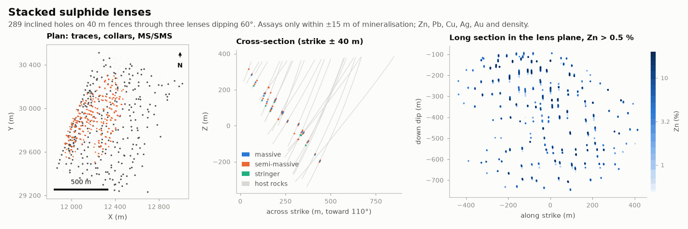

# Stacked sulphide lenses

MINING · 3D · SYNTHETIC

Three dipping polymetallic lenses cut by 289 holes. Synthetic dataset.

## About the data

289 holes: `DD` on 40 m fences, `RC` over the subcrop. Three stacked lenses dipping 60° toward 110. `LITH`: `MS` massive, `SMS` semi-massive, `STR` footwall stringer, `VCL` volcaniclastic host, `FWV` footwall volcanics, `HWS` hangingwall sediments, `DYK` dyke, `OB` overburden. Only mineralised zones ±15 m are assayed; elsewhere grades are empty. `RC` has no `AU_GPT` or `DENSITY`. `DENSITY` follows the sulphide mass balance and is measured in half of the mineralised samples. Cu increases toward the footwall. `lens_1..3.stl`, `topography.csv`.

## Suggested exercises

- Composite inside the lens solids and estimate Zn, Pb, Cu, Ag, Au per lens.
- Estimate density and grade-times-density for correct tonnage and metal.
- Check the Cu zoning toward the footwall with a local trend.

Techniques: multivariate · density · domains · solids.

## Files

| File | Rows | Size |
|---|---|---|
| [`assays.csv`](assays.csv) | 16 995 | 0.8 MB |
| [`collars.csv`](collars.csv) | 289 | 12 kB |
| [`lens_1.stl`](lens_1.stl) | | 1.6 MB |
| [`lens_2.stl`](lens_2.stl) | | 1.3 MB |
| [`lens_3.stl`](lens_3.stl) | | 1.3 MB |
| [`lithology.csv`](lithology.csv) | 1 726 | 41 kB |
| [`surveys.csv`](surveys.csv) | 4 348 | 0.1 MB |
| [`topography.csv`](topography.csv) | 18 471 | 0.4 MB |

## Columns

### `assays.csv`

| Column | Unit | Range / values | Missing |
|---|---|---|---|
| `HOLE_ID` |  | `DD0030` … `RC0045` (178 unique) |  |
| `FROM` | m | 0 – 799 |  |
| `TO` | m | 1 – 801 |  |
| `ZN_PCT` | % | 0.004 – 39.2 |  |
| `PB_PCT` | % | 0.001 – 17.4 |  |
| `CU_PCT` | % | 0 – 16.47 |  |
| `AG_GPT` | g/t | 0 – 488.9 |  |
| `AU_GPT` | g/t | 0 – 21.8 | 26% |
| `DENSITY` | t/m³ | 2.82 – 4.77 | 91% |

### `collars.csv`

| Column | Unit | Range / values | Missing |
|---|---|---|---|
| `HOLE_ID` |  | `DD0001` … `RC0045` (289 unique) |  |
| `X` | m | 11869 – 13013 |  |
| `Y` | m | 29235 – 30513 |  |
| `Z` | m | 354.8 – 403.5 |  |
| `LENGTH` | m | 47.41 – 958.1 |  |
| `TYPE` |  | `DD`, `RC` |  |

### `lithology.csv`

| Column | Unit | Range / values | Missing |
|---|---|---|---|
| `HOLE_ID` |  | `DD0001` … `RC0045` (289 unique) |  |
| `FROM` | m | 0 – 861.2 |  |
| `TO` | m | 0.25 – 958.1 |  |
| `LITH` |  | `VCL`, `OB`, `SMS`, `FWV`, `HWS`, `MS`, `STR`, `DYK` |  |

### `surveys.csv`

| Column | Unit | Range / values | Missing |
|---|---|---|---|
| `HOLE_ID` |  | `DD0001` … `RC0045` (289 unique) |  |
| `DEPTH` | m | 0 – 958.1 |  |
| `DIP` | ° | 44.85 – 75.17 |  |
| `AZIMUTH` | ° | 287.8 – 307.9 |  |

### `topography.csv`

| Column | Unit | Range / values | Missing |
|---|---|---|---|
| `X` | m | 10800 – 13600 |  |
| `Y` | m | 28900 – 31500 |  |
| `Z` | m | 354.7 – 414.6 |  |

[← all datasets](../../../README.md)
