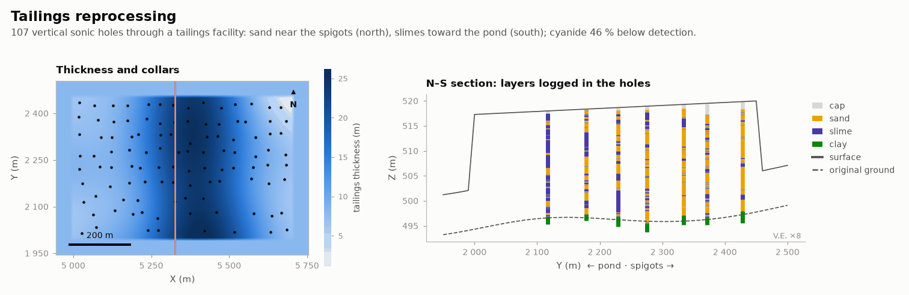

# Tailings reprocessing

MINING · 3D · SYNTHETIC

Beach-to-pond layering in a tailings storage facility. Synthetic dataset.

## About the data

107 vertical sonic holes through a tailings storage facility into 1–2.5 m of natural ground, sparser near the pond. `LITH`: `CAP` cover, `SAND`, `SLIME`, `CLAY` (natural ground). Slimes dominate toward the pond (south). Au is higher in older, deeper tailings. `CN_WAD_PPM` detection limit 0.5 (`CN_WAD_BDL`, ~46 % censored). `surface.csv` (current) and `original_ground.csv` (pre-deposition).

## Suggested exercises

- Simulate SAND/SLIME with a north-south proportion trend.
- Treat censored `CN_WAD_PPM` by indicator or maximum likelihood.
- Compute tonnage and residual Au between `surface.csv` and `original_ground.csv`.

Techniques: censored data · facies trend · surfaces.

## Files

| File | Rows | Size |
|---|---|---|
| [`assays.csv`](assays.csv) | 4 129 | 0.2 MB |
| [`collars.csv`](collars.csv) | 107 | 4 kB |
| [`lithology.csv`](lithology.csv) | 3 724 | 83 kB |
| [`original_ground.csv`](original_ground.csv) | 4 536 | 99 kB |
| [`surface.csv`](surface.csv) | 4 536 | 99 kB |
| [`surveys.csv`](surveys.csv) | 214 | 4 kB |

## Columns

### `assays.csv`

| Column | Unit | Range / values | Missing |
|---|---|---|---|
| `HOLE_ID` |  | `TS001` … `TS107` (107 unique) |  |
| `FROM` | m | 0 – 26.75 |  |
| `TO` | m | 0.05 – 27.8 |  |
| `AU_GPT` | g/t | 0.002 – 2.216 | 2% |
| `CU_PPM` | ppm | 14 – 2450 | 2% |
| `AS_PPM` | ppm | 4 – 4039 |  |
| `CN_WAD_PPM` | ppm | 0.5 – 33.41 |  |
| `MOISTURE_PCT` | % | 5 – 42.8 |  |
| `CN_WAD_BDL` | flag | `0`, `1` |  |

### `collars.csv`

| Column | Unit | Range / values | Missing |
|---|---|---|---|
| `HOLE_ID` |  | `TS001` … `TS107` (107 unique) |  |
| `X` | m | 5018 – 5684 |  |
| `Y` | m | 2015 – 2434 |  |
| `Z` | m | 517.4 – 519.9 |  |
| `LENGTH` | m | 5.7 – 27.8 |  |
| `TYPE` |  | `SONIC` |  |

### `lithology.csv`

| Column | Unit | Range / values | Missing |
|---|---|---|---|
| `HOLE_ID` |  | `TS001` … `TS107` (107 unique) |  |
| `FROM` | m | 0 – 25.7 |  |
| `TO` | m | 0.05 – 27.8 |  |
| `LITH` |  | `SAND`, `SLIME`, `CLAY`, `CAP` |  |

### `original_ground.csv`

| Column | Unit | Range / values | Missing |
|---|---|---|---|
| `X` | m | 4950 – 5750 |  |
| `Y` | m | 1950 – 2500 |  |
| `Z` | m | 490.2 – 521.6 |  |

### `surface.csv`

| Column | Unit | Range / values | Missing |
|---|---|---|---|
| `X` | m | 4950 – 5750 |  |
| `Y` | m | 1950 – 2500 |  |
| `Z` | m | 498.2 – 529.6 |  |

### `surveys.csv`

| Column | Unit | Range / values | Missing |
|---|---|---|---|
| `HOLE_ID` |  | `TS001` … `TS107` (107 unique) |  |
| `DEPTH` | m | 0 – 27.8 |  |
| `DIP` | ° | `90` |  |
| `AZIMUTH` | ° | `0` |  |

[← all datasets](../../../README.md)
