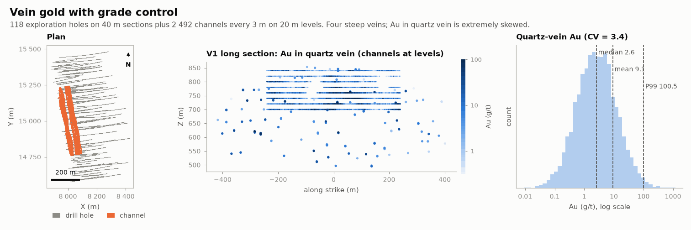

# Vein gold grade control

MINING · 3D · SYNTHETIC

Four steep veins, 118 drill holes and 2 492 channels. Synthetic dataset.

## About the data

Two meshes: 118 surface `DD` holes on 40 m sections, and 2 492 horizontal `CH` channels every 3 m on 20 m levels across veins V1 and V2 (0.5 m samples in vein, no `AS_PPM`). `LITH`: `QV` quartz vein, `BX` breccia halo, `AND` andesite, `RHY` barren post-mineral cover; `VEIN` = V1–V4. Au is very skewed, for top-cutting and indicator methods. `vein_V1..4.stl` (cut at the cover base), `topography.csv`.

## Suggested exercises

- Choose a top-cut for Au in `QV`; compare with indicator or lognormal kriging.
- Estimate V1 from drill holes only, then from channels; compare tonnage and grade.
- Model the vein as a thin domain (unfolded or accumulation, grade × thickness).

Techniques: extreme skewness · top-cut · indicators · thin domains.

## Files

| File | Rows | Size |
|---|---|---|
| [`assays.csv`](assays.csv) | 39 799 | 1.4 MB |
| [`collars.csv`](collars.csv) | 2 610 | 99 kB |
| [`lithology.csv`](lithology.csv) | 10 954 | 0.3 MB |
| [`surveys.csv`](surveys.csv) | 6 736 | 0.2 MB |
| [`topography.csv`](topography.csv) | 5 041 | 0.1 MB |
| [`vein_V1.stl`](vein_V1.stl) | | 2.7 MB |
| [`vein_V2.stl`](vein_V2.stl) | | 0.7 MB |
| [`vein_V3.stl`](vein_V3.stl) | | 0.9 MB |
| [`vein_V4.stl`](vein_V4.stl) | | 0.3 MB |

## Columns

### `assays.csv`

| Column | Unit | Range / values | Missing |
|---|---|---|---|
| `HOLE_ID` |  | `CH00001` … `UD0118` (2610 unique) |  |
| `FROM` | m | 0 – 686 |  |
| `TO` | m | 0.05 – 687.9 |  |
| `AU_GPT` | g/t | 0.005 – 1192 |  |
| `AG_GPT` | g/t | 0.02 – 163958 |  |
| `AS_PPM` | ppm | 1 – 3040 | 47% |

### `collars.csv`

| Column | Unit | Range / values | Missing |
|---|---|---|---|
| `HOLE_ID` |  | `CH00001` … `UD0118` (2610 unique) |  |
| `X` | m | 7938 – 8473 |  |
| `Y` | m | 14616 – 15490 |  |
| `Z` | m | 700 – 929.2 |  |
| `LENGTH` | m | 2.78 – 687.9 |  |
| `TYPE` |  | `CH`, `DD` |  |

### `lithology.csv`

| Column | Unit | Range / values | Missing |
|---|---|---|---|
| `HOLE_ID` |  | `CH00001` … `UD0118` (2610 unique) |  |
| `FROM` | m | 0 – 556.5 |  |
| `TO` | m | 0.05 – 687.9 |  |
| `LITH` |  | `BX`, `AND`, `QV`, `RHY` |  |
| `VEIN` |  | `V1`, `V2`, `V3`, `V4` | 27% |

### `surveys.csv`

| Column | Unit | Range / values | Missing |
|---|---|---|---|
| `HOLE_ID` |  | `CH00001` … `UD0118` (2610 unique) |  |
| `DEPTH` | m | 0 – 687.9 |  |
| `DIP` | ° | 0 – 70 |  |
| `AZIMUTH` | ° | 250.1 – 272.7 |  |

### `topography.csv`

| Column | Unit | Range / values | Missing |
|---|---|---|---|
| `X` | m | 7300 – 8700 |  |
| `Y` | m | 14300 – 15700 |  |
| `Z` | m | 871.2 – 943.1 |  |

[← all datasets](../../../README.md)
