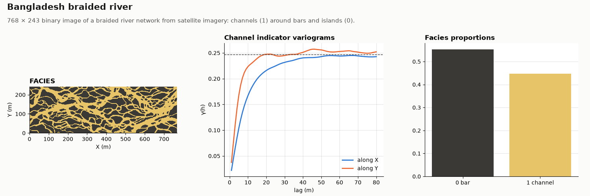

# Bangladesh

OIL-GAS · 2D · CLASSIC

A 768 × 243 braided-river channel network. Classic public dataset, kept as published.

## About the data

768 × 243 cells of 1 × 1 m, cell centres `X` from 0.5 to 767.5, `Y` from 0.5 to 242.5 (the grid starts at 0, 0). The spacing is nominal; the image has no physical scale. `FACIES` 1 = channel, 0 = bar or island (45 / 55 %). The network is digitized from imagery of a braided river in Bangladesh; channels run broadly along `X`.

Mariethoz, G. & Caers, J. (2014). *Multiple-point Geostatistics: Stochastic Modeling with Training Images*. Wiley-Blackwell. [doi](https://doi.org/10.1002/9781118662953)

From the training-image library of the book, [GAIA-UNIL/trainingimages](https://github.com/GAIA-UNIL/trainingimages), [GPL-3.0](https://www.gnu.org/licenses/gpl-3.0.html); the book page adds that the images may be used freely for research. This copy is shared under the same license.

## Suggested exercises

- Simulate the network with MPS and check that channels stay connected across the image.
- Compare connectivity functions of the image and of a truncated Gaussian simulation with the same proportions.
- Train on a crop and test how much of the pattern the realizations recover.

Techniques: training image · MPS · connectivity · non-stationarity.

## Files

| File | Rows | Size |
|---|---|---|
| [`training_image.csv`](training_image.csv) | 186 624 | 2.5 MB |

## Columns

### `training_image.csv`

| Column | Unit | Range / values | Missing |
|---|---|---|---|
| `X` | m | 0.5 – 767.5 |  |
| `Y` | m | 0.5 – 242.5 |  |
| `FACIES` |  | `0`, `1` |  |

[← all datasets](../../../README.md)
