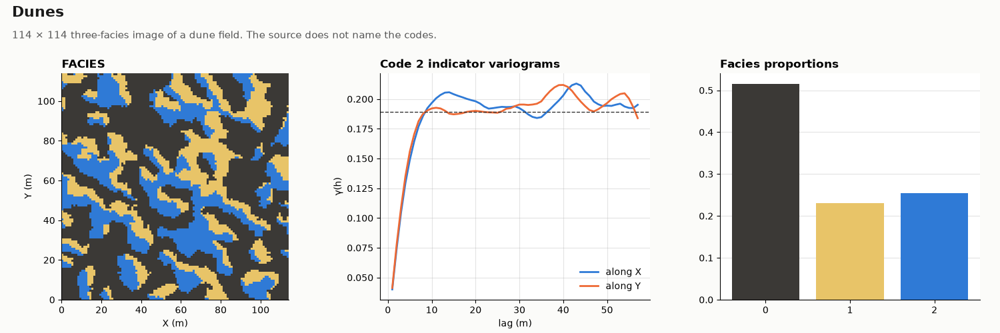

# Dunes

OIL-GAS · 2D · CLASSIC

A 114 × 114 three-facies dune field. Classic public dataset, kept as published.

## About the data

114 × 114 cells of 1 × 1 m, cell centres `X` from 0.5 to 113.5, `Y` from 0.5 to 113.5 (the grid starts at 0, 0). The spacing is nominal; the image has no physical scale. `FACIES` codes 0, 1, 2 (52 / 23 / 25 %); the source does not name them.

Mariethoz, G. & Caers, J. (2014). *Multiple-point Geostatistics: Stochastic Modeling with Training Images*. Wiley-Blackwell. [doi](https://doi.org/10.1002/9781118662953)

From the training-image library of the book, [GAIA-UNIL/trainingimages](https://github.com/GAIA-UNIL/trainingimages), [GPL-3.0](https://www.gnu.org/licenses/gpl-3.0.html); the book page adds that the images may be used freely for research. This copy is shared under the same license.

## Suggested exercises

- Use the image as a small, fast training image to tune MPS template size.
- Compare the facies proportions and transition frequencies of the image and the realizations.
- Check whether the realizations keep the ordering of codes across dune boundaries.

Techniques: training image · MPS · template size · facies transitions.

## Files

| File | Rows | Size |
|---|---|---|
| [`training_image.csv`](training_image.csv) | 12 996 | 157 kB |

## Columns

### `training_image.csv`

| Column | Unit | Range / values | Missing |
|---|---|---|---|
| `X` | m | 0.5 – 113.5 |  |
| `Y` | m | 0.5 – 113.5 |  |
| `FACIES` |  | `0`, `1`, `2` |  |

[← all datasets](../../../README.md)
