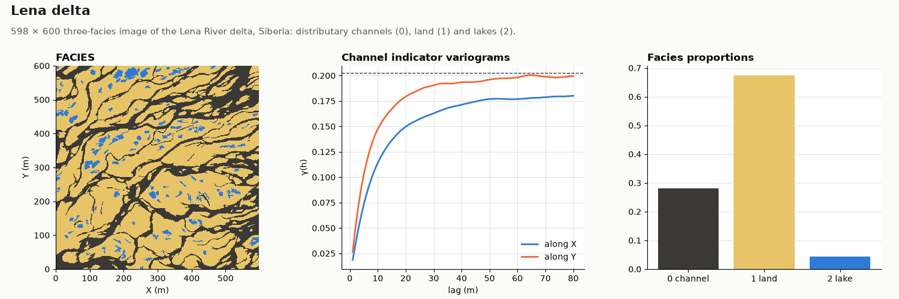

# Lena delta

OIL-GAS · 2D · CLASSIC

Channels, land and lakes of the Lena River delta, Siberia. Classic public dataset, kept as published.

## About the data

598 × 600 cells of 1 × 1 m, cell centres `X` from 0.5 to 597.5, `Y` from 0.5 to 599.5 (the grid starts at 0, 0). The spacing is nominal; the image has no physical scale. `FACIES` 0 = channel, 1 = land, 2 = lake (28 / 67 / 4 %).

Mariethoz, G. & Caers, J. (2014). *Multiple-point Geostatistics: Stochastic Modeling with Training Images*. Wiley-Blackwell. [doi](https://doi.org/10.1002/9781118662953)

From the training-image library of the book, [GAIA-UNIL/trainingimages](https://github.com/GAIA-UNIL/trainingimages), [GPL-3.0](https://www.gnu.org/licenses/gpl-3.0.html); the book page adds that the images may be used freely for research. This copy is shared under the same license.

## Suggested exercises

- Simulate the three facies with MPS and check that the rare lakes keep their size and shape.
- Compare channel indicator variograms along `X` and `Y`.
- Simulate with sequential indicator simulation and compare lake and channel connectivity.

Techniques: training image · MPS · multiple facies · rare facies.

## Files

| File | Rows | Size |
|---|---|---|
| [`training_image.csv`](training_image.csv) | 358 800 | 4.9 MB |

## Columns

### `training_image.csv`

| Column | Unit | Range / values | Missing |
|---|---|---|---|
| `X` | m | 0.5 – 597.5 |  |
| `Y` | m | 0.5 – 599.5 |  |
| `FACIES` |  | `0`, `1`, `2` |  |

[← all datasets](../../../README.md)
