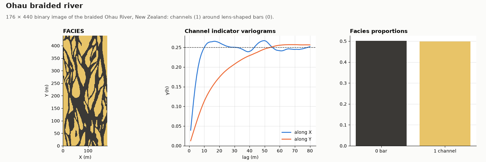

# Ohau

OIL-GAS · 2D · CLASSIC

The braided Ohau River, New Zealand, 176 × 440. Classic public dataset, kept as published.

## About the data

176 × 440 cells of 1 × 1 m, cell centres `X` from 0.5 to 175.5, `Y` from 0.5 to 439.5 (the grid starts at 0, 0). The spacing is nominal; the image has no physical scale. `FACIES` 1 = channel, 0 = bar (50 / 50 %). Lens-shaped bars elongated along `Y`, the flow direction.

Mariethoz, G. & Caers, J. (2014). *Multiple-point Geostatistics: Stochastic Modeling with Training Images*. Wiley-Blackwell. [doi](https://doi.org/10.1002/9781118662953)

From the training-image library of the book, [GAIA-UNIL/trainingimages](https://github.com/GAIA-UNIL/trainingimages), [GPL-3.0](https://www.gnu.org/licenses/gpl-3.0.html); the book page adds that the images may be used freely for research. This copy is shared under the same license.

## Suggested exercises

- Simulate with MPS and compare bar length and width distributions with the image.
- Compare indicator variograms along and across flow.
- Rotate the image and test how sensitive MPS is to a misaligned training image.

Techniques: training image · MPS · anisotropy · object shapes.

## Files

| File | Rows | Size |
|---|---|---|
| [`training_image.csv`](training_image.csv) | 77 440 | 1.0 MB |

## Columns

### `training_image.csv`

| Column | Unit | Range / values | Missing |
|---|---|---|---|
| `X` | m | 0.5 – 175.5 |  |
| `Y` | m | 0.5 – 439.5 |  |
| `FACIES` |  | `0`, `1` |  |

[← all datasets](../../../README.md)
