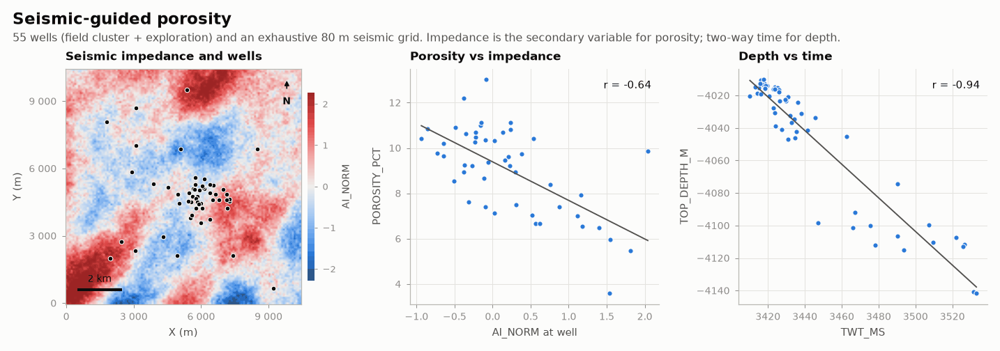

# Seismic-guided porosity

OIL-GAS · 2D · SYNTHETIC

55 wells and an exhaustive seismic grid. Synthetic dataset.

## About the data

55 wells in `wells.csv`: a field cluster and scattered exploration wells. `TOP_DEPTH_M`, `TWT_MS`, `THICKNESS_M`, `POROSITY_PCT`, `AI_NORM` (normalised impedance at the well), `PHIH_M` = porosity × thickness. `seismic.csv`: 80 m grid of `TWT_MS` and `AI_NORM`. Porosity vs AI correlation ≈ −0.65; depth vs time ≈ −0.94. Porosity missing in ~12 % of wells.

## Suggested exercises

- Collocated cokriging of porosity with `AI_NORM`.
- Depth conversion: kriging with external drift of `TOP_DEPTH_M` on `TWT_MS`.
- Decluster the field cluster before computing the porosity histogram.

Techniques: collocated cokriging · depth conversion · clustered wells.

## Files

| File | Rows | Size |
|---|---|---|
| [`seismic.csv`](seismic.csv) | 17 161 | 0.5 MB |
| [`wells.csv`](wells.csv) | 55 | 3 kB |

## Columns

### `seismic.csv`

| Column | Unit | Range / values | Missing |
|---|---|---|---|
| `X` | m | 0 – 10400 |  |
| `Y` | m | 0 – 10400 |  |
| `TWT_MS` | ms | 3408 – 3609 |  |
| `AI_NORM` | normalised | -2.397 – 3.586 |  |

### `wells.csv`

| Column | Unit | Range / values | Missing |
|---|---|---|---|
| `WELL` |  | `W01` … `W55` (55 unique) |  |
| `X` | m | 1808 – 9218 |  |
| `Y` | m | 654 – 9509 |  |
| `TOP_DEPTH_M` | m | -4142 – -4010 |  |
| `TWT_MS` | ms | 3410 – 3533 |  |
| `THICKNESS_M` | m | 48.7 – 73.7 |  |
| `POROSITY_PCT` | % | 3.59 – 13.02 | 13% |
| `AI_NORM` | normalised | -0.937 – 2.04 |  |
| `PHIH_M` | m | 2.366 – 9.4 | 13% |

[← all datasets](../../../README.md)
