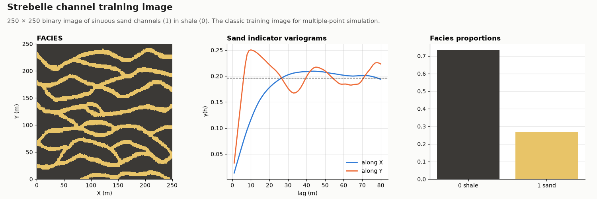

# Strebelle

OIL-GAS · 2D · CLASSIC

The 250 × 250 channel training image. Classic public dataset, kept as published.

## About the data

250 × 250 cells of 1 × 1 m, cell centres `X` from 0.5 to 249.5, `Y` from 0.5 to 249.5 (the grid starts at 0, 0). The spacing is nominal; the image has no physical scale. `FACIES` 0 = shale, 1 = sand (73 / 27 %). Sinuous sand channels run along `X`.

Strebelle, S. (2002). Conditional simulation of complex geological structures using multiple-point statistics. *Mathematical Geology* 34(1), 1–21. [doi](https://doi.org/10.1023/A:1014009426274)

Mariethoz, G. & Caers, J. (2014). *Multiple-point Geostatistics: Stochastic Modeling with Training Images*. Wiley-Blackwell. [doi](https://doi.org/10.1002/9781118662953)

From the training-image library of the book, [GAIA-UNIL/trainingimages](https://github.com/GAIA-UNIL/trainingimages), [GPL-3.0](https://www.gnu.org/licenses/gpl-3.0.html); the book page adds that the images may be used freely for research. This copy is shared under the same license.

## Suggested exercises

- Use the image as the training image for multiple-point simulation, unconditional and conditioned to a few sand and shale points.
- Compare indicator variograms of the image with those of a sequential indicator simulation: close variograms, different connectivity.
- Measure channel connectivity along `X` in the image and in the realizations.

Techniques: training image · MPS · indicator variograms · connectivity.

## Files

| File | Rows | Size |
|---|---|---|
| [`training_image.csv`](training_image.csv) | 62 500 | 820 kB |

## Columns

### `training_image.csv`

| Column | Unit | Range / values | Missing |
|---|---|---|---|
| `X` | m | 0.5 – 249.5 |  |
| `Y` | m | 0.5 – 249.5 |  |
| `FACIES` |  | `0`, `1` |  |

[← all datasets](../../../README.md)
