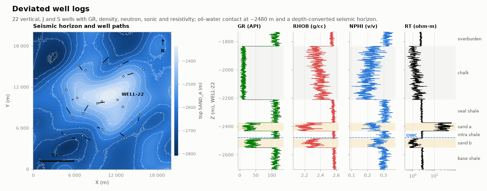

# Deviated well logs

OIL-GAS · 3D · SYNTHETIC

22 deviated wells with logs, tops and a seismic horizon. Synthetic dataset.

## About the data

22 wells, vertical, J and S profiles. `logs.csv` every 0.5 m: `GR` (API), `RHOB` (g/cc), `NPHI` (v/v), `DT` (µs/ft), `RT` (ohm·m), `ZONE`; interpreted `PHIE`, `SW`, `VSH` only in the 12 calibrated wells. `DT` missing in 7 wells, `NPHI` in 4. Zones: `CHALK`, `SEAL_SHALE`, `SAND_A`, `INTRA_SHALE`, `SAND_B`, `BASE_SHALE`. Oil–water contact at −2480 m. `tops.csv` holds well tops. `seismic_top_sand_a.csv` is the depth-converted top of SAND_A with error, for kriging with external drift.

## Suggested exercises

- Compute Vsh, porosity and Sw from the logs; check against `PHIE`, `SW`, `VSH`.
- Krige the top of SAND_A with external drift on the seismic horizon.
- Estimate DT where it is missing from the other logs (heterotopic cokriging).

Techniques: petrophysics · external drift · heterotopic logs.

## Files

| File | Rows | Size |
|---|---|---|
| [`logs.csv`](logs.csv) | 52 486 | 4.5 MB |
| [`seismic_top_sand_a.csv`](seismic_top_sand_a.csv) | 40 401 | 1.0 MB |
| [`tops.csv`](tops.csv) | 132 | 7 kB |
| [`trajectories.csv`](trajectories.csv) | 2 316 | 64 kB |
| [`wells.csv`](wells.csv) | 22 | 1 kB |

## Columns

### `logs.csv`

| Column | Unit | Range / values | Missing |
|---|---|---|---|
| `WELL` |  | `WELL-01` … `WELL-22` (22 unique) |  |
| `MD` | m | 1648 – 3630 |  |
| `X` | m | 4114 – 16000 |  |
| `Y` | m | 4217 – 16323 |  |
| `Z` | m | -3049 – -1623 |  |
| `GR` | API | -3.6 – 136.8 |  |
| `RHOB` | g/cc | 2.057 – 2.639 |  |
| `NPHI` | v/v | 0.055 – 0.379 | 17% |
| `DT` | µs/ft | 54.2 – 101.7 | 32% |
| `RT` | ohm·m | 0.452 – 111.9 |  |
| `PHIE` | v/v | 0.051 – 0.329 | 44% |
| `SW` | v/v | 0.12 – 1 | 44% |
| `VSH` | v/v | 0 – 1 | 44% |
| `ZONE` |  | `CHALK`, `OVERBURDEN`, `BASE_SHALE`, `SEAL_SHALE`, `SAND_B`, `SAND_A`, `INTRA_SHALE` |  |

### `seismic_top_sand_a.csv`

| Column | Unit | Range / values | Missing |
|---|---|---|---|
| `X` | m | 0 – 20000 |  |
| `Y` | m | 0 – 20000 |  |
| `Z` | m | -2809 – -2334 |  |

### `tops.csv`

| Column | Unit | Range / values | Missing |
|---|---|---|---|
| `WELL` |  | `WELL-01` … `WELL-22` (22 unique) |  |
| `SURFACE` |  | `TOP_CHALK`, `TOP_SEAL_SHALE`, `TOP_SAND_A`, `TOP_INTRA_SHALE`, `TOP_SAND_B`, `TOP_BASE_SHALE` |  |
| `MD` | m | 1855 – 3396 |  |
| `X` | m | 4124 – 15999 |  |
| `Y` | m | 4293 – 16297 |  |
| `Z` | m | -2913 – -1830 |  |

### `trajectories.csv`

| Column | Unit | Range / values | Missing |
|---|---|---|---|
| `WELL` |  | `WELL-01` … `WELL-22` (22 unique) |  |
| `MD` | m | 0 – 3630 |  |
| `INCLINATION` | ° | 0 – 47.55 |  |
| `AZIMUTH` | ° | 30.58 – 330.5 |  |

### `wells.csv`

| Column | Unit | Range / values | Missing |
|---|---|---|---|
| `WELL` |  | `WELL-01` … `WELL-22` (22 unique) |  |
| `X` | m | 4571 – 15991 |  |
| `Y` | m | 4359 – 15397 |  |
| `KB` | m | `25` |  |
| `TD_MD` | m | 2670 – 3630 |  |
| `PROFILE` |  | `J`, `VERTICAL`, `S` |  |

[← all datasets](../../../README.md)
