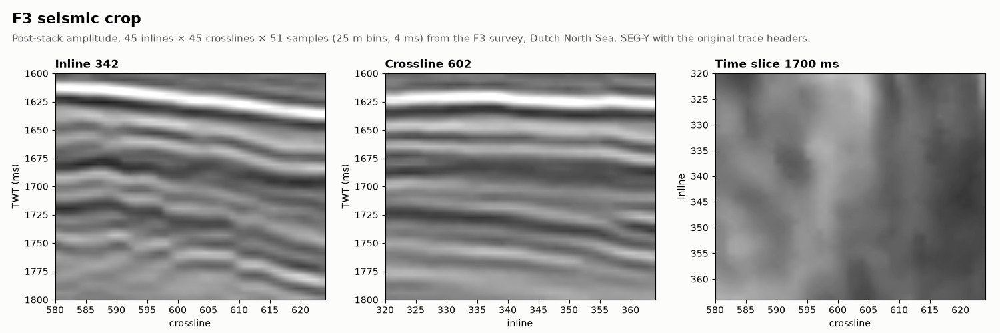

# F3 seismic

OIL-GAS · 3D · CLASSIC

A 45 × 45-trace crop of the F3 post-stack cube, Dutch North Sea, as SEG-Y. Classic public dataset, cropped.

## About the data

Inlines 320 – 364, crosslines 580 – 624 (2 025 traces), two-way time 1600 – 1800 ms at 4 ms (51 samples). 25 m bins. Dip-steered median-filtered amplitude, 4-byte IEEE floats (format 5), big-endian SEG-Y rev 1. Dipping reflectors cut by normal faults.

The textual, binary and trace headers are those of the original survey export. Inline and crossline numbers are at trace-header bytes 189 and 193; CDP X and Y at 181 and 185, scaled by the coordinate scalar at byte 71 (−10: stored in decimetres); first-sample time at byte 109. Coordinates are in ED50 / UTM zone 31N (EPSG:23031), which the file does not state.

F3 block, Dutch sector of the North Sea. Seismic released by the Dutch government through TNO and published by dGB Earth Sciences under [CC BY-SA 3.0](https://creativecommons.org/licenses/by-sa/3.0/); this crop is shared under the same license.

`crop.py` cuts the file, byte for byte, from the 201 × 201-trace subvolume `F3_Dip_steered_median_subvolume_IL230-430_XL475-675_T1600-1800.sgy`.

## Suggested exercises

- Read the cube, check the grid geometry against the CDP coordinates and plot inline, crossline and time slices.
- Pick the strong reflector near 1625 ms and grid it as a time surface.
- Model the variogram of the amplitude on a time slice; compare the ranges along inlines and crosslines.

Techniques: SEG-Y · seismic geometry · horizons · variography.

## Files

| File | Traces | Size |
|---|---|---|
| [`seismic.sgy`](seismic.sgy) | 2 025 | 903 kB |
| [`crop.py`](crop.py) |  | 1 kB |

## Trace headers

### `seismic.sgy`

| Header | Byte | Range / values |
|---|---|---|
| Inline | 189 | 320 – 364 |
| Crossline | 193 | 580 – 624 |
| CDP X | 181 | 612 648.5 – 613 778.8 m |
| CDP Y | 185 | 6 079 249.6 – 6 080 379.9 m |
| Coordinate scalar | 71 | −10 |
| First sample | 109 | 1600 ms |
| Amplitude | samples | −17 711 – 10 591 |

[← all datasets](../../../README.md)
