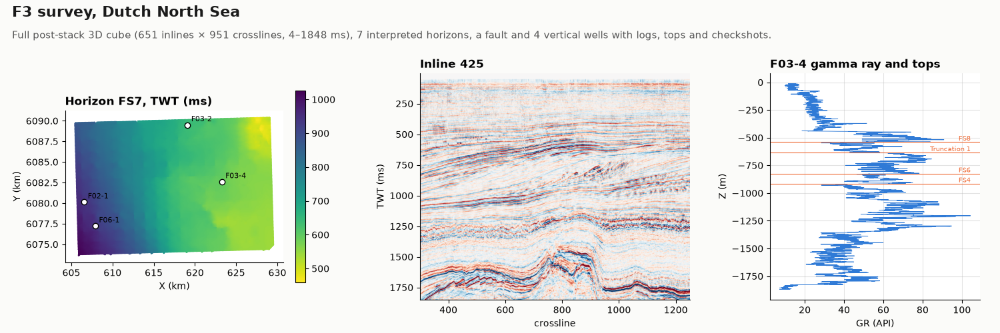

# F3 survey

OIL-GAS · 3D · CLASSIC

The full F3 post-stack cube, Dutch North Sea, with horizons, a fault and four wells. Classic public dataset, kept as published.

## About the data

**The data files are not in this repository** (0.85 GB); download them from the Zenodo record, or rebuild them with `python make.py F3_Demo_2023.zip` from the [F3 Demo 2023](https://terranubis.com/datainfo/F3-Demo-2023) project on TerraNubis.

`seismic.sgy` is the project's `Rawdata/Seismic_data.sgy`, byte for byte: inlines 100 – 750, crosslines 300 – 1250 (600 515 of 619 101 traces present), two-way time 4 – 1848 ms at 4 ms (462 samples), 25 m bins. Amplitudes are 2-byte integers (format 3), big-endian SEG-Y rev 1. Inline and crossline numbers are at trace-header bytes 189 and 193, CDP X and Y at 181 and 185, scaled by the coordinate scalar at byte 71 (−10: stored in decimetres). Coordinates are in ED50 / UTM zone 31N (EPSG:23031), as the textual header states.

`horizons.csv` holds seven interpreted horizons as `X, Y` points with two-way time. `faults.csv` holds the sticks of one normal fault. Wells are vertical: `Z` = `KB` − `MD`, elevation in metres, negative below sea level; `KB` is the kelly bushing above sea level. `RHOB` in kg/m³, `DT` in µs/m, `AI` and `AI_REL` (absolute and relative P-impedance) in (m/s)·(kg/m³), `PHIE` as a fraction, as delivered in the LAS files. `tops.csv` and `checkshots.csv` carry the operators' markers and time–depth pairs; some go deeper than the logs, and the F03-2 checkshots are not monotonic at the bottom, as published.

F3 block, Dutch sector of the North Sea. Seismic released by the Dutch government through TNO; project published by dGB Earth Sciences under [CC BY-SA 3.0](https://creativecommons.org/licenses/by-sa/3.0/); this copy is shared under the same license. dGB asks for this acknowledgement: "We thank dGB Earth Sciences for making the data available as an OpendTect project via their TerraNubis portal (terranubis.com)." Well information: [NLOG](https://www.nlog.nl).

## Suggested exercises

- Tie the four wells to the seismic with the checkshots and compare the tops with the horizons.
- Grid a horizon from the picks and krige its two-way time; cross-validate at the wells.
- Convert FS7 to depth with a velocity model fitted to the checkshots, then krige the depth residuals at the wells with the time surface as external drift.
- Estimate porosity on a horizon from `PHIE` at the wells and the seismic amplitude along the horizon (collocated cokriging).

Techniques: SEG-Y · well tie · time-to-depth conversion · external drift · collocated cokriging.

## Files

| File | Rows | Size |
|---|---|---|
| `seismic.sgy` | 600 515 traces | 699 MB |
| `horizons.csv` | 3 750 474 | 164 MB |
| `faults.csv` | 207 | 8 kB |
| `wells.csv` | 4 | 0.1 kB |
| `logs.csv` | 47 348 | 3.5 MB |
| `tops.csv` | 97 | 3 kB |
| `checkshots.csv` | 98 | 2 kB |
| [`make.py`](make.py) | | 4 kB |

## Columns

### `horizons.csv`

| Column | Unit | Range / values | Missing |
|---|---|---|---|
| `HORIZON` |  | `FS6`, `FS7`, `FS8`, `MFS4`, `Shallow`, `Top-Foresets`, `Truncation` |  |
| `X` | m | 605 433 – 629 532 |  |
| `Y` | m | 6 073 633 – 6 090 413 |  |
| `TWT_MS` | ms | 332.8 – 1097.9 |  |

### `faults.csv`

| Column | Unit | Range / values | Missing |
|---|---|---|---|
| `FAULT` |  | `FaultA` |  |
| `STICK` |  | 0 – 12 |  |
| `NODE` |  | 0 – 18 |  |
| `X` | m | 619 190 – 624 690 |  |
| `Y` | m | 6 074 093 – 6 079 929 |  |
| `TWT_MS` | ms | 210.5 – 1804.3 |  |

### `wells.csv`

| Column | Unit | Range / values | Missing |
|---|---|---|---|
| `WELL` |  | `F02-1`, `F03-2`, `F03-4`, `F06-1` |  |
| `X` | m | 606 554 – 623 256 |  |
| `Y` | m | 6 077 213 – 6 089 491 |  |
| `KB` | m | 28.64 – 30 |  |
| `TD_MD` | m | 1699.9 – 3150 |  |

### `logs.csv`

| Column | Unit | Range / values | Missing |
|---|---|---|---|
| `WELL` |  | `F02-1`, `F03-2`, `F03-4`, `F06-1` |  |
| `MD` | m | 29.4 – 2139.6 |  |
| `Z` | m | -2109.6 – -0.15 |  |
| `RHOB` | kg/m³ | 1350 – 2994 | 4% |
| `DT` | µs/m | 165.9 – 667.9 | 1% |
| `GR` | API | -2.8 – 133.5 |  |
| `AI` | (m/s)·(kg/m³) | 2.04e6 – 1.80e7 | 1% |
| `AI_REL` | (m/s)·(kg/m³) | -2.01e6 – 8.99e6 | 1% |
| `PHIE` | fraction | -0.215 – 0.709 | 11% |

### `tops.csv`

| Column | Unit | Range / values | Missing |
|---|---|---|---|
| `WELL` |  | `F02-1`, `F03-2`, `F03-4`, `F06-1` |  |
| `SURFACE` |  | 40 markers, e.g. `Seasurface`, `MFS11`, `FS8`, `FS7`, `Truncation 1`, `Top Foresets`, `FS6`, `MFS4`, `FS4` |  |
| `MD` | m | 30 – 3150 |  |
| `Z` | m | -3120 – 0 |  |

### `checkshots.csv`

| Column | Unit | Range / values | Missing |
|---|---|---|---|
| `WELL` |  | `F02-1`, `F03-2`, `F03-4`, `F06-1` |  |
| `MD` | m | 28.64 – 3150 |  |
| `Z` | m | -3120 – 0 |  |
| `TWT_MS` | ms | 0 – 3234 |  |

[← all datasets](../../../README.md)
