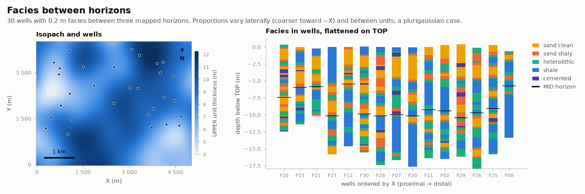

# Facies between horizons

OIL-GAS · 3D · SYNTHETIC

30 wells with 0.2 m facies between three horizons. Synthetic dataset.

## About the data

30 wells, some deviated. `facies.csv` every 0.2 m between `TOP_Z` and `BASE_Z`: 1 `SAND_CLEAN`, 2 `SAND_SHALY`, 3 `HETEROLITHIC`, 4 `SHALE`, 5 `CEMENTED`. The `UPPER` unit coarsens upward and fines toward +X; the `LOWER` unit is muddier. Cemented concretions occur only inside sandstones. `horizons.csv`: 50 m grid of `TOP_Z`, `MID_Z`, `BASE_Z`.

## Suggested exercises

- Build vertical proportion curves per unit from the wells.
- Fit a plurigaussian rule and simulate facies in a stratigraphic grid.
- Map the lateral proportion trend and compare stationary vs non-stationary simulations.

Techniques: plurigaussian · proportion trends · stratigraphic grids.

## Files

| File | Rows | Size |
|---|---|---|
| [`facies.csv`](facies.csv) | 2 292 | 0.1 MB |
| [`horizons.csv`](horizons.csv) | 8 181 | 0.3 MB |
| [`trajectories.csv`](trajectories.csv) | 1 884 | 42 kB |
| [`wells.csv`](wells.csv) | 30 | 1 kB |

## Columns

### `facies.csv`

| Column | Unit | Range / values | Missing |
|---|---|---|---|
| `WELL` |  | `F01` … `F30` (30 unique) |  |
| `MD_FROM` | m | 1484 – 1531 |  |
| `MD_TO` | m | 1485 – 1531 |  |
| `X` | m | 285.5 – 4685 |  |
| `Y` | m | 1000 – 3742 |  |
| `Z` | m | -1521 – -1474 |  |
| `UNIT` |  | `UPPER`, `LOWER` |  |
| `FACIES` |  | `4`, `1`, `3`, `2`, `5` |  |
| `FACIES_NAME` |  | `SHALE`, `SAND_CLEAN`, `HETEROLITHIC`, `SAND_SHALY`, `CEMENTED` |  |

### `horizons.csv`

| Column | Unit | Range / values | Missing |
|---|---|---|---|
| `X` | m | 0 – 5000 |  |
| `Y` | m | 0 – 4000 |  |
| `TOP_Z` | m | -1511 – -1470 |  |
| `MID_Z` | m | -1519 – -1475 |  |
| `BASE_Z` | m | -1527 – -1480 |  |

### `trajectories.csv`

| Column | Unit | Range / values | Missing |
|---|---|---|---|
| `WELL` |  | `F01` … `F30` (30 unique) |  |
| `MD` | m | 0 – 1550 |  |
| `INCLINATION` | ° | 0 – 21 |  |
| `AZIMUTH` | ° | 31.14 – 356.8 |  |

### `wells.csv`

| Column | Unit | Range / values | Missing |
|---|---|---|---|
| `WELL` |  | `F01` … `F30` (30 unique) |  |
| `X` | m | 285.5 – 4685 |  |
| `Y` | m | 1000 – 3771 |  |
| `KB` | m | `10` |  |
| `TD_MD` | m | `1550`, `1525`, `1547` |  |

[← all datasets](../../../README.md)
