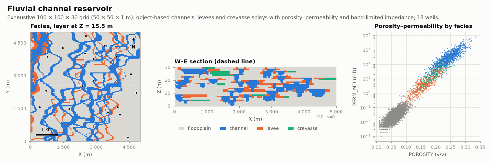

# Fluvial channel reservoir

OIL-GAS · 3D · SYNTHETIC

Exhaustive channel, levee and splay grid with 18 wells. Synthetic dataset.

## About the data

`grid.csv`: 100 × 100 × 30 cells of 50 × 50 × 1 m. Facies 0 `FLOODPLAIN`, 1 `CHANNEL`, 2 `LEVEE`, 3 `CREVASSE` (65 / 21 / 10 / 4 %). `POROSITY`, `PERM_MD` (log-linear in porosity), `AI_SEISMIC` (vertically smoothed impedance). `wells.csv`: 18 vertical wells taken from the grid. Use it as a training image, a reference truth, or a hard-data + seismic case.

## Suggested exercises

- Use the grid as a training image for multiple-point simulation.
- Condition facies and porosity to the 18 wells; use `AI_SEISMIC` as soft data.
- Fit the poro-perm transform by facies and compare with cloud transform.

Techniques: training image · MPS · poro-perm · seismic secondary.

## Files

| File | Rows | Size |
|---|---|---|
| [`grid.csv`](grid.csv) | 300 000 | 12.2 MB |
| [`wells.csv`](wells.csv) | 540 | 24 kB |

## Columns

### `grid.csv`

| Column | Unit | Range / values | Missing |
|---|---|---|---|
| `X` | m | 25 – 4975 |  |
| `Y` | m | 25 – 4975 |  |
| `Z` | m | 0.5 – 29.5 |  |
| `FACIES` |  | `0`, `1`, `2`, `3` |  |
| `POROSITY` | v/v | 0.01 – 0.35 |  |
| `PERM_MD` | mD | 0.001 – 26570 |  |
| `AI_SEISMIC` | normalised | 7.205 – 10.92 |  |

### `wells.csv`

| Column | Unit | Range / values | Missing |
|---|---|---|---|
| `WELL` |  | `R01`, `R02`, `R03`, `R04`, `R05`, `R06`, `R07`, `R08` … (18) |  |
| `X` | m | 425 – 4825 |  |
| `Y` | m | 175 – 4825 |  |
| `Z` | m | 0.5 – 29.5 |  |
| `FACIES` |  | `0`, `1`, `2`, `3` |  |
| `POROSITY` | v/v | 0.01 – 0.316 |  |
| `PERM_MD` | mD | 0.002 – 4109 |  |
| `AI_SEISMIC` | normalised | 8.09 – 10.7 |  |

[← all datasets](../../../README.md)
