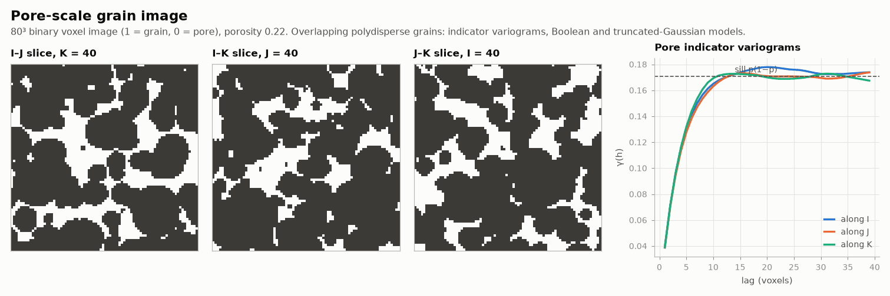

# Pore-scale grain image

OIL-GAS · 3D · SYNTHETIC

An 80³ binary grain and pore voxel image. Synthetic dataset.

## About the data

80³ voxels, `GRAIN` 1 = grain, 0 = pore, indexed by `I, J, K`. Porosity 0.22. Polydisperse, slightly ellipsoidal, overlapping grains.

## Suggested exercises

- Fit indicator variograms and compare with a Boolean model of spheres.
- Simulate by truncated Gaussian at the same porosity and compare connectivity.
- Compute specific surface area and a two-point connectivity function.

Techniques: indicator variograms · Boolean model · truncated Gaussian.

## Files

| File | Rows | Size |
|---|---|---|
| [`image.csv`](image.csv) | 512 000 | 6.0 MB |

## Columns

### `image.csv`

| Column | Unit | Range / values | Missing |
|---|---|---|---|
| `I` |  | 0 – 79 |  |
| `J` |  | 0 – 79 |  |
| `K` |  | 0 – 79 |  |
| `GRAIN` |  | `1`, `0` |  |

[← all datasets](../../../README.md)
