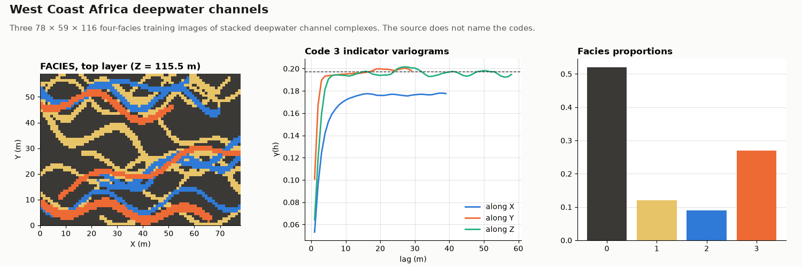

# West Coast Africa

OIL-GAS · 3D · CLASSIC

Three 3D training images of stacked deepwater channels. Classic public dataset, kept as published.

## About the data

78 × 59 × 116 cells of 1 × 1 × 1 m, cell centres `X` from 0.5 to 77.5, `Y` from 0.5 to 58.5, `Z` from 0.5 to 115.5 (the grid starts at 0, 0, 0). The spacing is nominal; the images have no physical scale. `FACIES_1`, `FACIES_2` and `FACIES_3` are three alternative training images on the same grid, codes 0, 1, 2, 3 (about 52 / 12 / 9 / 27 % in each); the source does not name the codes. Sinuous channels run along `X`. From the reservoir case study in Part III of the book.

Mariethoz, G. & Caers, J. (2014). *Multiple-point Geostatistics: Stochastic Modeling with Training Images*. Wiley-Blackwell. [doi](https://doi.org/10.1002/9781118662953)

From the training-image library of the book, [GAIA-UNIL/trainingimages](https://github.com/GAIA-UNIL/trainingimages), [GPL-3.0](https://www.gnu.org/licenses/gpl-3.0.html); the book page adds that the images may be used freely for research. This copy is shared under the same license.

## Suggested exercises

- Simulate with each training image and compare the spread of the results: training-image uncertainty.
- Compute indicator variograms of code 3 along `X`, `Y` and `Z` for the three images.
- Extract a few vertical wells from one image and simulate conditioned to them with the other two.

Techniques: 3D training images · MPS · scenario uncertainty · conditioning.

## Files

| File | Rows | Size |
|---|---|---|
| [`training_images.csv`](training_images.csv) | 533 832 | 11 MB |

## Columns

### `training_images.csv`

| Column | Unit | Range / values | Missing |
|---|---|---|---|
| `X` | m | 0.5 – 77.5 |  |
| `Y` | m | 0.5 – 58.5 |  |
| `Z` | m | 0.5 – 115.5 |  |
| `FACIES_1` |  | `0`, `1`, `2`, `3` |  |
| `FACIES_2` |  | `0`, `1`, `2`, `3` |  |
| `FACIES_3` |  | `0`, `1`, `2`, `3` |  |

[← all datasets](../../../README.md)
